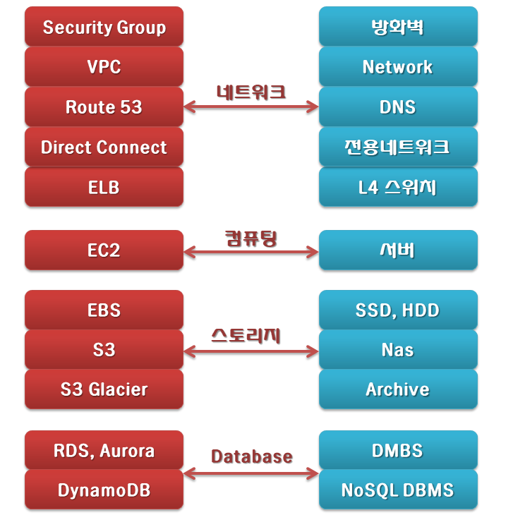
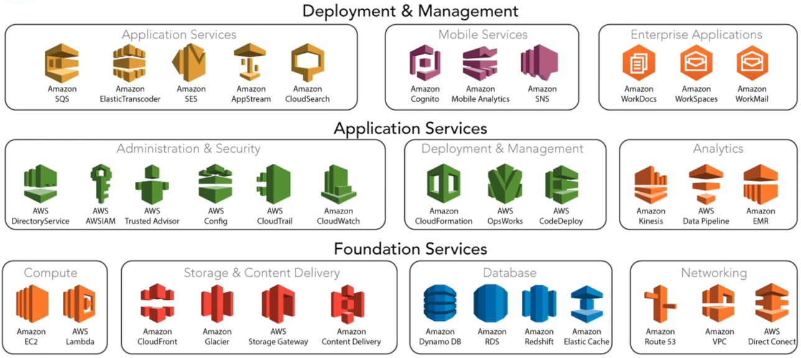

AWS vs 전통적인 인프라
=====

AWS Services
=====

- **컴퓨팅**
   - **`EC2`**: EC2 (Elastic Compute Cloud)는 AWS에서 가장 기본적이면서 널리 쓰이는 인프라로 EC2는 일종의 가상서버로 CPU와 RAM을 제공
   - **`ECS`**: ECS (Elastic Container Service)는 AWS에서 단일 또는 수천 개의 Docker 컨테이너를 쉽게 실행하고 보안을 적용할 수 있음
   - **`EC2 Auto Scaling`**: 트래픽이 늘어나면 자동으로 EC2 인스턴스를 생성해 서비스를 확장하는 기능
   - **`Lambda`** : 이벤트에 응답하여 코드를 실행하고 자동으로 기본 컴퓨팅 리소스를 관리하는 서버 없는 컴퓨팅 서비스

- **스토리지**
   - **`S3`**: S3 (Simple Storage Service)는 인터넷 스토리지 서비스로 용량에 관계 없이 파일을 저장하고 웹에서 파일에 접근
   - **`EBS`**: EBS (Elastic Block Storage)는 EC2 인스턴스에 장착하여 사용할 수 있는 가상 저장 장치로, 최대 16 TiB까지 생성이 가능
   - **`Glacier`**: 데이터 보관(Archive) 및 백업 전용 스토리지로, 요금이 매우 저렴하지만, 파일을 검색하는데 시간이 필요

   
- **데이터베이스**
   - **`RDS`**: RDS (Relational Database Service)는 관리형 관계형 데이터베이스 서비스로, 총 6개의 데이터베이스 엔진을 인스턴스 단위로 실행
   - **`Aurora`**: 클라우드를 위해 구축된 DB로 MySQL 및 PostgreSQL과 호환되며, 저렴한 비용으로 이용이 가능
   - **`DynamoDB`**: 아마존에서 개발한 NoSQL 데이터베이스를 제공하는 서비스로, 읽고 쓰는 처리 속도가 매우 빠름

- **네트워킹**
   - **`VPC`**: VPC (Virtual Private Cloud)는 가상 네트워크 서비스로 사용자의 상황에 맞게 VPC를 생성해 여러가지 형태의 네트워크를 구성
   - **`CloudFront`**: 전 세계에 파일을 빠른 속도로 배포하는 CDN 서비스로 전세계 24개국에 엣지 로케이션(캐시서버)이 있음
   - **`Route 53`**: EC2, ELB, S3, CloudFront와 연동 가능한 DNS(Domain Name System) 서비스로 가용성과 확장성이 뛰어남
   - **`ELB`**: ELB (Elastic Load Balancing)는 부하 분산과 고가용성을 제공하는 서비스로 고가의 L4/L7 장비를 구입 없이 부하 분산 기능을 사용

EKS
-----
1. [**EKS**](./EKS.md) - Amazon Elastic Kubernetes Service (Amazon EKS)