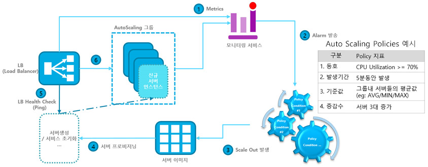

AWS vs 전통적인 인프라
=====

인프라 확장
=====
1. 인프라 확장 - `Scale Up`/`Scale Out`/`Auto Scaling`
1. 데이터베이스 확장 - `Master, Slave`/`Shading`
1. NoSQL 사용

AWS Services
=====

- **컴퓨팅**
   - **`EC2`**: EC2 (Elastic Compute Cloud)는 AWS에서 가장 기본적이면서 널리 쓰이는 인프라로 EC2는 일종의 가상서버로 CPU와 RAM을 제공
   - **`EC2 Auto Scaling`**: 트래픽이 늘어나면 자동으로 EC2 인스턴스를 생성해 서비스를 확장하는 기능
   - **`ECS`**: ECS (Elastic Container Service)는 AWS에서 단일 또는 수천 개의 Docker 컨테이너를 쉽게 실행하고 보안을 적용할 수 있음
   - **`Lambda`** : 이벤트에 응답하여 코드를 실행하고 자동으로 기본 컴퓨팅 리소스를 관리하는 서버 없는 컴퓨팅 서비스

- **스토리지**
   - **`S3`**: S3 (Simple Storage Service)는 인터넷 스토리지 서비스로 용량에 관계 없이 파일을 저장하고 웹에서 파일에 접근
   - **`EBS`**: EBS (Elastic Block Storage)는 EC2 인스턴스에 장착하여 사용할 수 있는 가상 저장 장치로, 최대 16 TiB까지 생성이 가능
   - **`Glacier`**: 데이터 보관(Archive) 및 백업 전용 스토리지로, 요금이 매우 저렴하지만, 파일을 검색하는데 시간이 필요

   
- **데이터베이스**
   - **`RDS`**: RDS (Relational Database Service)는 관리형 관계형 데이터베이스 서비스로, 총 6개의 데이터베이스 엔진을 인스턴스 단위로 실행
   - **`Aurora`**: 클라우드를 위해 구축된 DB로 MySQL 및 PostgreSQL과 호환되며, 저렴한 비용으로 이용이 가능
   - **`DynamoDB`**: 아마존에서 개발한 NoSQL 데이터베이스를 제공하는 서비스로, 읽고 쓰는 처리 속도가 매우 빠름

- **네트워킹**
   - **`ELB`**: ELB (Elastic Load Balancing)는 부하 분산과 고가용성을 제공하는 서비스로 고가의 L4/L7 장비를 구입 없이 부하 분산 기능을 사용
   - **`VPC`**: VPC (Virtual Private Cloud)는 가상 네트워크 서비스로 사용자의 상황에 맞게 VPC를 생성해 여러가지 형태의 네트워크를 구성
   - **`CloudFront`**: 전 세계에 파일을 빠른 속도로 배포하는 CDN 서비스로 전세계 24개국에 엣지 로케이션(캐시서버)이 있음
   - **`Route 53`**: `EC2`, `ELB`, `S3`, `CloudFront`와 연동 가능한 DNS(Domain Name System) 서비스로 가용성과 확장성이 뛰어남

[EC2 Auto Scaling](https://docs.aws.amazon.com/ko_kr/autoscaling/)
-----
1. 판단을 위한 메트릭 지표 
   - 부하에 따라 자동으로 규모 변경
   - 현재의 규모 유지
   - 시간에 따른 변경

1. 동작 원리

   

[S3](https://aws.amazon.com/ko/s3/)
-----
1. Simple Storage Service의 약자로 클라우드 스토리지
1. 많은 사용자가 접속을 해도 이를 감당하기 위한 시스템 작업을 하지 않아도 됨
1. 정적 웹사이트 코드 배포에 용이
1. 정적 웹사이트 호스팅에 필요한 다양한 기능 제공
1. AWS Cloudfront와 함께 사용해서 최적화 가능하고 DNS 관리도 가능
1. 파일에 인증을 붙여서 무단으로 엑세스 하지 못하도록 할 수 있음
1. REST, SOAP 인터페이스를 제공
1. 최소 1바이트에서 5TB의 데이터를 저장, 서비스
   - 1G의 첨부파일을 저장하고 월 30G의 트래픽(전송)이 발생했다면 스타벅스 커피 한잔 정도의 요금 `50원 + (150원 x 30G) =  4,550 원` 발생

[Amazon CloudWatch](https://aws.amazon.com/ko/cloudwatch/)
-----
1. DevOps 엔지니어, 개발자, SRE(사이트 안정성 엔지니어) 및 IT 관리자를 위해 구축된 모니터링 및 관찰 기능 서비스
1. 애플리케이션을 모니터링하고, 시스템 전반의 성능 변경 사항에 대응하며, 리소스 사용률을 최적화
1. 운영 상태에 대한 통합된 보기를 확보하는 데 필요한 데이터와 실행 가능한 통찰력을 제공
1. 로그, 지표 및 이벤트 형태로 모니터링 및 운영 데이터를 수집하여 AWS와 온프레미스 서버에서 실행되는 AWS 리소스, 애플리케이션 및 서비스에 대한 통합된 보기를 제공

[Elastic Load Balancing](https://aws.amazon.com/ko/elasticloadbalancing)
-----
1. 트래픽 분산
1. 자동 확장
1. 인스턴스의 상태를 자동 감지해서 오류가 있는 시스템은 배제
1. 사용자 세션을 특정 인스턴스에 고정
1. SSL 암호화 지원 
1. SSL의 경유지로 ELB를 사용하는 경우에 SSL 처리에 따른 부하를 ELB가 수용하게 된다.
1. IPv4, IPv6 지원
1. CloudWatch를 통해서 모니터링
1. 사용한 시간과 통과한 트래픽에 따라서 종량제로 과금

[Amazon ElastiCache](https://aws.amazon.com/ko/elasticache/)
-----
1. Amazon ElastiCache 엔진
   - Redis용 Amazon ElastiCache
   - Memcached용 Amazon ElastiCache

[Route 53](https://aws.amazon.com/ko/route53)
-----
1. 고가용성과 안정성
1. 다른 Amazon Web Services와 연동

[AWS CloudFront](https://aws.amazon.com/ko/cloudfront/)
-----
1. .HTML, .CSS, .JS 및 이미지 파일과 같은 정적 및 동적 웹 콘텐츠를 사용자에게 더 빨리 배포하도록 지원하는 웹 서비스
1. 특징
   - 엣지 로케이션이라고 하는 데이터 센터의 전 세계 네트워크를 통해 콘텐츠를 제공
   - CloudFront를 통해 서비스하는 콘텐츠를 사용자가 요청하면 지연 시간이 가장 낮은 엣지 로케이션으로 라우팅되므로 콘텐츠 전송 성능이 뛰어남
   - 콘텐츠가 엣지 로케이션에 없는 경우 CloudFront는 콘텐츠의 최종 버전에 대한 소스로 지정된 오리진(Amazon S3 버킷, MediaPackge 채널, HTTP 서버(예 : 웹 서버)등) 에서 콘텐츠를 검색
   - AWS 백본 네트워크를 통해 콘텐츠를 가장 효과적으로 서비스할 수 있는 엣지로 각 사용자 요청을 라우팅하여 콘텐츠 배포 속도를 높임
   - AWS 네트워크를 사용하면 사용자의 요청이 반드시 통과해야 하는 네트워크의 수가 줄어들어 성능이 향상
   - 파일(객체)의 사본이 전 세계 여러 엣지 로케이션에 유지(또는 캐시)되므로 안정성과 가용성이 향상

[EKS](https://aws.amazon.com/ko/eks/)
-----
1. [**EKS**](./EKS.md) - Amazon Elastic Kubernetes Service (Amazon EKS)

[ECR](https://aws.amazon.com/ko/ecr/)
-----
1. Elastic Container Registry
1. 도커 이미지를 저장하는 private repository
1. 실제 프로덕션 환경에서는 container 기반의 배포 (ECS 등을 활용) 할 것이기 때문에 반드시 repository가 있어야 함

[ECS](https://aws.amazon.com/ko/ecs/)
-----
1. Elastic Container Service
1. 도커 컨테이너 기반으로 서비스 운용을 가능하게 해주는 간단한 서비스
1. 무중단 배포 (Rolling Update)를 제공하며 scale up 이 가능한 특징
1. 백엔드 서비스를 scale up 가능한 형태로 배포하는데 최적화
1. 수많은 도커 컨테이너 서버를 띄우고 LB가 이를 로드 밸런싱 해줌
1. fargate, ec2 모드가 있어서 docker container 리소스만 띄우거나 또는 물리적인 EC2 인스턴스를 클러스터로 구성 가능

[Amazon SES](https://aws.amazon.com/ko/ses/)
-----
1. 마케팅, 알림 및 트랜잭션 이메일을 발송하는 데 도움이 되도록 설계된 클라우드 기반 이메일 발송 서비스

| 구분 | 세부내용 |
|:---:|:---|
| 트랜잭션 메시지 | 구매 확인, 배송 알림, 주문 상태 업데이트, 정책 변경 공지 등과 같은 자동 이메일을 발송하여 고객에게 최신 정보를 알림 |
| 프로모션 메시지 | 광고, 뉴스레터, 특별 제안, 그 밖에 고객이 원하는 유형의 중요 콘텐츠를 전송하여 제품과 서비스를 홍보 |

[Amazon SNS](https://aws.amazon.com/ko/sns/)
-----
1. 애플리케이션 간(A2A) 및 애플리케이션과 사용자 간(A2P) 통신 모두를 위한 완전관리형 메시징 서비스

[Amazon SQS](https://aws.amazon.com/ko/sqs/)
-----
1. 해야 할 일을 나중에 처리하거나, 다른 시스템이 처리 할 수 있도록 하기 위한 비동기 메시징 서비스
1. 마이크로 서비스, 분산 시스템 및 서버리스 애플리케이션을 쉽게 분리하고 확장할 수 있도록 지원하는 완전관리형 메시지 대기열 서비스
1. 예를 들어, Youtube를 AWS에서 구축한다고 해보자. Youtube는 대규모의 사용자가 전송하는 대용량의 데이터를 수신해서 처리해야 하는 서비스다. 이런 서비스는 여러개의 독립적인 시스템을 구축하고 각각의 시스템이 서로 협력하는 방식으로 구현하는 것이 보다 효율적이다. 예를 들어 아래와 같은 시스템들이 있을 것이다.
	
	   - 사용자가 업로드한 동영상을 수신하는 시스템 [수신자]
	   - 업로드된 동영상을 전달 받아서 이를 인코딩하는 시스템 [인코더]
	   - 인코딩이 끝났음을 업로더에게 이메일로 발송하는 시스템 [메일러]
	
	이러한 시스템들이 서로 협력하기 위해서는 서로의 진행상황을 공유해야 할 필요가 있다. 우선 수신자가 SQS 서비스에 업로드된 동영상을 추가한다. 인코더는 정기적으로 SQS를 확인한다. SQS에 추가된 동영상 파일이 발견되면 인코딩을 시작한다. 인코딩이 끝나면 SQS에 인코딩이 끝난 동영상을 추가한다. 메일러는 SQS에 인코딩이 끝난 동영상이 존재하는지 확인한다. 동영상이 발견되면 해당 동영상의 업로더에게 이메일을 발송한다.

[AWS Lambda](https://aws.amazon.com/ko/lambda/)
-----
1. 서버 프로비저닝 또는 관리, 워크로드 인식 확장 로직 생성, 이벤트 통합 유지, 또는 런타임 관리 없이 코드를 실행할 수 있는 서버리스 컴퓨팅 서비스
1. 사실상 모든 유형의 애플리케이션이나 백엔드 서비스에 대한 코드를 별도의 관리 없이 실행할 수 있음

[AWS CodeDeploy](https://aws.amazon.com/ko/codedeploy/)
-----
1. Amazon EC2, AWS Fargate, AWS Lambda 및 온프레미스 서버와 같은 다양한 컴퓨팅 서비스에 대한 소프트웨어 배포를 자동화하는 완전관리형 배포 서비스
