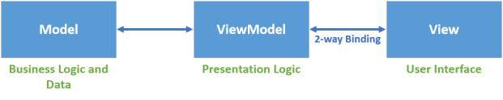
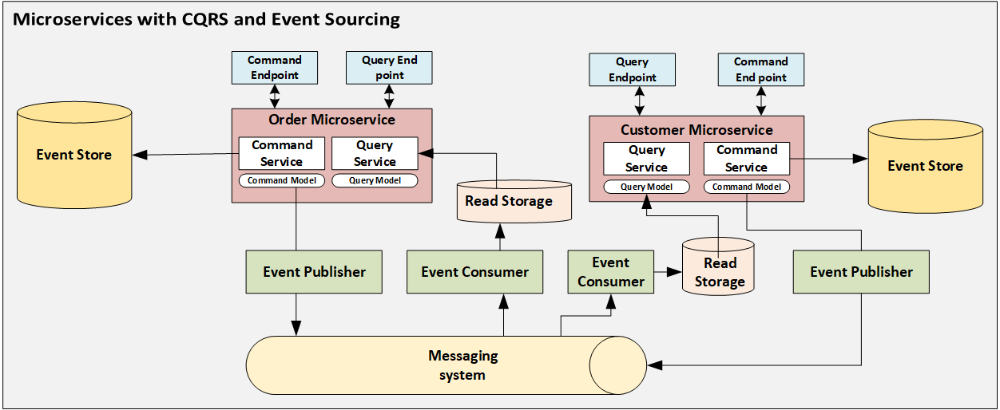

아키텍쳐
=====

## Application 아키텍쳐

- **OCP와 전략 패턴**

- **MVC 패턴**

- **메모리 캐시**

- **어플리케이션 캐시**

- **레벨2 캐시**

- **MVVM**
   
   - 불변 개체와 Rx를 활용해 상태를 관리하는 응용프로그램 아키텍쳐
   
   - MVVM 응용프로그램
   
   
   
   - MVVM 서비스 클라이언트 응용프로그램
   

- [**Reactive Programming**](./RxJS_202101.pdf)

   - **이벤트 스트림**을 **`Observable`** 이라는 객체로 표현한 후 **비동기 이벤트 기반**의 프로그램을 작성
   
   

## Software 아키텍쳐

- **이벤트 소싱**

- **CQRS**

- **MSA**

   - [**마이크로서비스**](./마이크로서비스.md)

   - [**서비스메쉬**](./이스티오.md)
