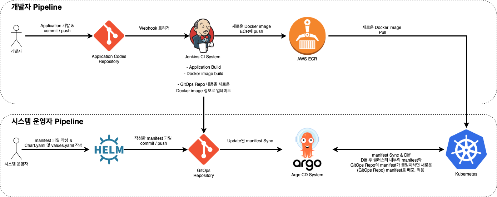

로컬 환경에 자동 배포 서버 구축하기
=====

#### **구축 인프라**

- [**출처 - 로컬 PC에 CI/CD 구축하기 (Jenkins, Ngrok, docker)/전준엽님**](https://galid1.tistory.com/743)

   - jenkins를 통해 **CI (Test와 Build 자동화)**, plugin과 script를 통해 **CD (배포 자동화)** 구축

   

   1. local server에 docker를 이용해 jenkins 구동
   1. develop server에서 code push
   1. local server의 jenkins에서 github로부터 webhook을 받으면 이를 알아차리고 코드를 다운받고, test & build
   1. jenkins plugin (publish over ssh)를 이용해 배포서버에 자동으로 전달

- **환경**

   - Docker Desktop - [https://docs.docker.com/docker-for-windows/install/](https://docs.docker.com/docker-for-windows/install/)
   - Kitematic - [https://github.com/docker/kitematic/releases](https://github.com/docker/kitematic/releases)
   - IntelliJ IDEA 2021.1.3 - [Ultimate Edition](https://www.jetbrains.com/ko-kr/idea/download)
   - Jenkins - [https://www.jenkins.io/](https://www.jenkins.io/)
   - Github - [https://github.com/](https://github.com/)

- **Step 1 _ < Jenkins 설치 >**

   1. Kitematic을 통해 Docker Hub에서 Jenkins 검색
   1. 원하는 jdk가 설치된 Jenkins 컨테이너 설치 및 구동

- **Step 2 _ < GitHub Repository 생성 >**

   1. 간단한 Spring Boot Application 작성
   1. GitHub Repository 생성 및 소스 push

- **Step 3 _ < GitHub webhook 설정 >**

   1. Ngrok 설정
   1. github 설정
   1. jenkins item 생성

- **Step 4 _ < 원격지에 배포하기 >**

   1. Jenkins SSH Plungin 추가
   1. Jenkins Remote Server 추가
   1. Jenkins Item에 Remote 배포 설정 추가

- **Step 5 _ < 테스트 >**

   1. jenkins 콘솔 출력 확인
   1. 브라우저로 어플리케이션 페이지 학인

AWS 환경에 자동 배포 서버 구축하기
=====

#### **구축 인프라 (Case #1)**

- [**출처 - Jenkins와 CodeDeploy를 이용한 AWS에 CI/CD 구축하기/전준엽님**](https://galid1.tistory.com/746) 

- CI/CD 파이프라인 구축
   - CodeDeploy Agent가 설치된 EC2 서버 2대(CodeDeploy와 S3에 접근가능한)
   - Load Balander
   - S3 버킷
   - CodeDeploy Application
   - Jenkins(+ AWS CodeDeploy Plugin)가 설치된 서버 1대 (CodeDeploy에 접근 가능한)

- 구성 요소
   - [**AWS CodeDeploy**](https://docs.aws.amazon.com/ko_kr/codedeploy/latest/userguide/welcome.html)
   - [**AWS SNS**](https://docs.aws.amazon.com/ko_kr/sns/latest/dg/welcome.html)
   - [**AWS Lambda**](https://docs.aws.amazon.com/ko_kr/lambda/latest/dg/welcome.html)

#### **구축 인프라 (Case #2)**

- [**출처 - MSA를 위한 Kubernetes 세팅과 CI/CD Pipeline 구성, 그리고 Monitoring 시스템 구축/방신철님**](https://medium.com/finda-tech/finda-msa%EB%A5%BC-%EC%9C%84%ED%95%9C-kubernetes-%EC%84%B8%ED%8C%85%EA%B3%BC-ci-cd-pipeline-%EA%B5%AC%EC%84%B1-%EA%B7%B8%EB%A6%AC%EA%B3%A0-monitoring-%EC%8B%9C%EC%8A%A4%ED%85%9C-%EA%B5%AC%EC%B6%95-2-ef29380ec474)

- 쿠버네티스 클러스터 구축
   - `AWS EKS` 서비스 활용

- CI/CD 파이프라인 구축
   - `Jenkins`, `Argo CD`, `GitOps` & `Helm`

- 구성 요소
   - [**HELM**](https://helm.sh/) - The package manager for Kubernetes
   - [**Argo CD**](https://argoproj.github.io/argo-cd/getting_started/) - A declarative, GitOps continuous delivery tool for Kubernetes

- 모니터링 환경 구축
   - 어플리케이션 모니터링 : `Fluentd` + `Elasticsearch` + `Kibana` → `Slack`
   - 인프라 스트럭쳐 모니터링 : `Cloudwatch` + `Lambda` → `Slack`
   - 배포 모니터링 : `Jenkins` & `Argo CD Notification` → `Slack`
