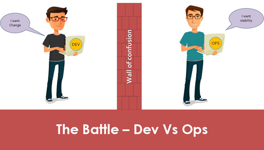
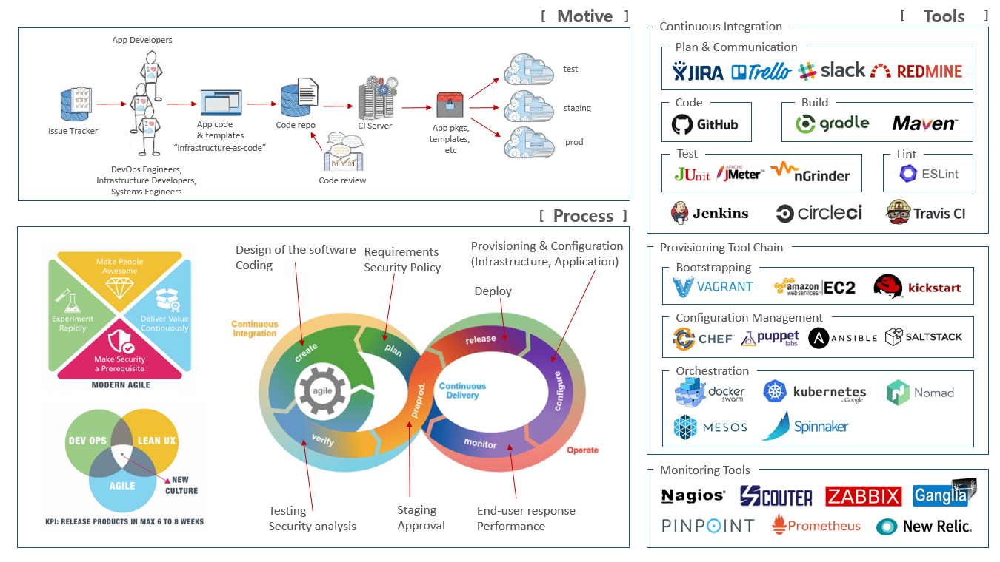

DevOps
=====
> 개발의 이슈를 운영팀이 해결해야 하는 상황이 옴  
> 범인 찾기  
> 욕하기  
> 문제 원인 분석  
> 문제 해결  
> 의사 소통  
> 협업

동기
=====

프로세스
=====

| 구분 | 설명 |
| :---: | :--- |
| 동기(Motive) | Dev와 Ops 간에 서로 다른 목표때문에 갈등이 발생한다. |
| | (Dev는 고객에게 제공한 변경을 빠르게 보기를 원하나, Ops는 안정성에 관심이 많음) |
| | 따라서, 공유된 목적에 대한 합의, Ownership, 가치의 공유 등이 중요하다. |
| 프로세스(Process) | 소프트웨어를 어떻게 개발하고 배포할지 정의하는 프로세스가 툴보다 중요하다. |
| | 개발에서 운영에 전달하는 속도를 관리하기 위한 프로세스를 만들고 최적화하여야 한다. |
| 도구(Tools) | DevOps의 능률은 자동화에 의존하며, |
| | 사용하는 도구는 version control, build, package, deployment, configuration 등이 있다. |

| 구분 | 설명 |
| :---: | :--- |
| 측정지표 관점 | quality, testing 등 |
| 프로세스 관점 | 협업, 빠른 피드백을 위한 흐름, 전체적인 프로세스 구성 |
| 기술 관점 | 자동화를 통한 빠른 피드백 "인프라를 코드로 관리하기"와 같은 자동화된 릴리즈 |