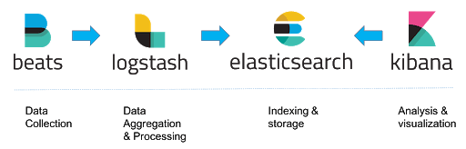
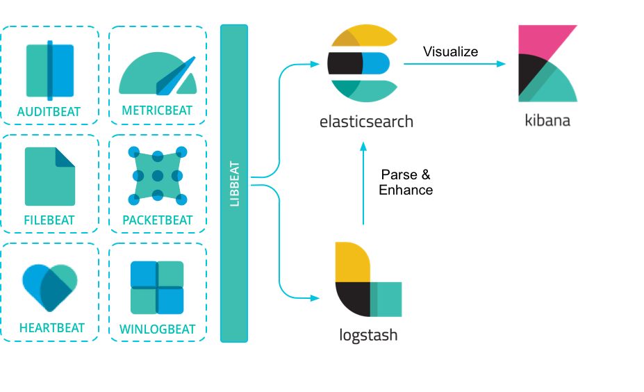
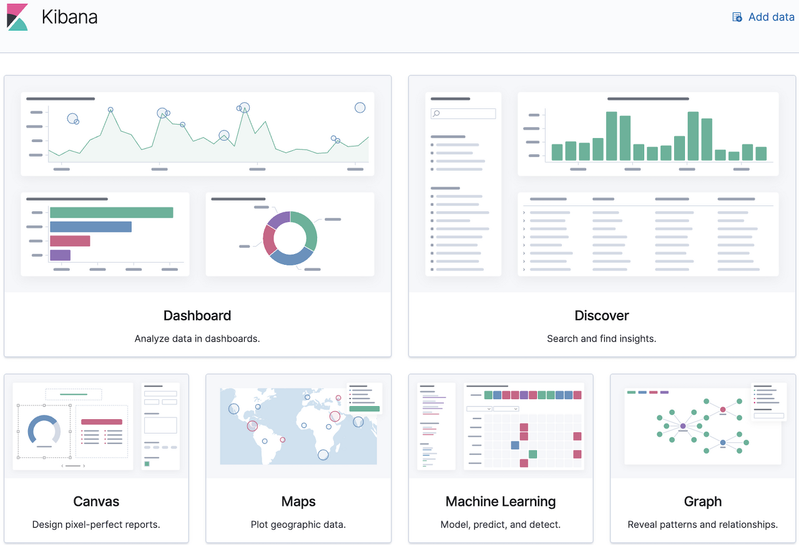
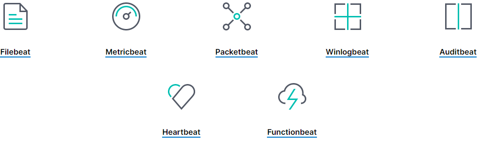

개념
=====

**ELK** stands for the monitoring solution which is mainly consist of **Elasticsearch**, **Logstash** and **Kibana**

Elastic Stack
=====

 

 - Elasticsearch
   - Store, Index, Search, Analyze
   - 특징
      - Elasticsearch는 분산 검색 및 분석 엔진이다.
      - 오픈 소스이며 모든 유형의 데이터에 사용할 수 있다.
      - Java 프로그래밍 언어로 구현되며 JVM (Java Virtual Machine)이 있는 모든 운영 체제를 지원한다.
      - 데이터 분석 및 시각화를 위한 오픈 소스 애플리케이션인 Elastic Stack 의 주요 구성 요소이다.
      - 확장성이 높고 작업 수행 속도가 빠르므로 데이터 분석, 처리 및 시각화를 위한 도구이다.

 - Logstash
   - Unify data from disparate sources
   - Normalize data into destinations

 - Kibana
   - Kibana is the front end GUI for Elasticsearch

Kibana
=====

 

Beats
=====

 
