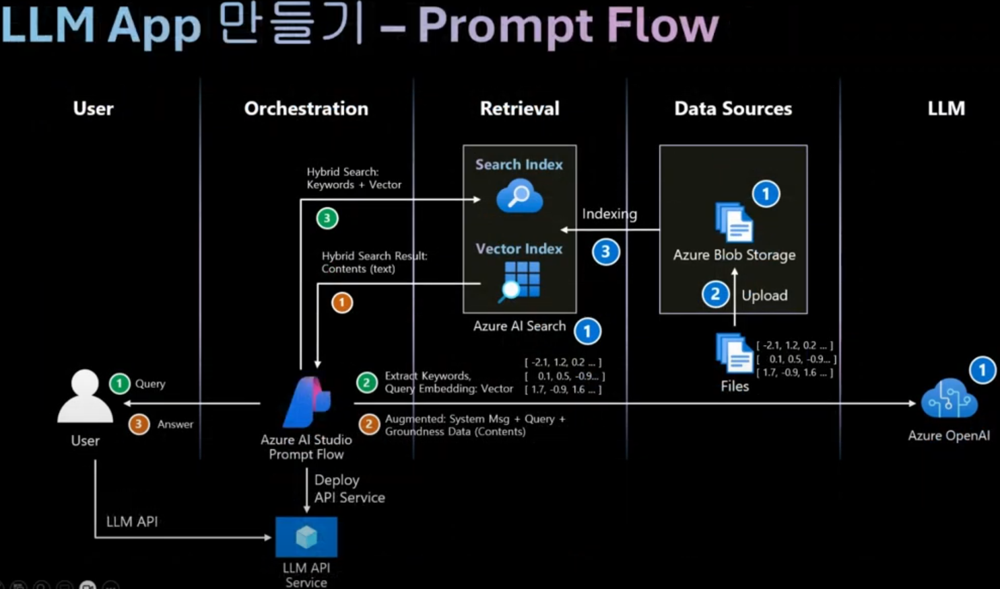

### Prompt Engineering, Fine-tuning, RAG, AI Agent

---

### **1. Prompt Engineering**
- **정의**:  
  Prompt Engineering은 **LLM(대규모 언어 모델)**에서 원하는 결과를 얻기 위해 입력 텍스트(prompt)를 설계하고 최적화하는 과정입니다. 모델을 학습시키지 않고 텍스트 입력을 통해 작업 결과를 조정합니다.

- **특징**:
  - 모델의 학습 파라미터를 변경하지 않음.
  - 텍스트 기반 입력을 정교하게 설계하여 원하는 결과를 얻음.
  - 간단한 작업부터 복잡한 작업까지 적용 가능.

- **활용 예**:
  - 문서 요약:  
    ```plaintext
    Summarize the following text in 3 bullet points: ...
    ```
  - 코드 생성:  
    ```plaintext
    Write a Python function to calculate the Fibonacci sequence.
    ```
  - 언어 번역:  
    ```plaintext
    Translate the following sentence to French: 'Good morning, how are you?'
    ```

- **장점**:
  - 빠르고 비용 효율적.
  - 모델 수정 없이 즉시 사용 가능.

- **단점**:
  - 복잡한 작업이나 도메인 특화 응답에는 한계.
  - 최적화된 결과를 얻기 위해 반복적인 실험 필요.

---

### **2. Fine-tuning**
- **정의**:  
  Fine-tuning은 사전 학습된 모델을 **특정 데이터셋**으로 추가 학습하여, 특정 태스크나 도메인에 맞게 최적화하는 기법입니다.

- **특징**:
  - 모델의 가중치를 업데이트하며, 특정 작업에 특화.
  - 더 많은 데이터와 컴퓨팅 리소스 필요.
  - 도메인 지식이 포함된 데이터를 통해 성능을 크게 향상.

- **활용 예**:
  - **도메인 특화 모델**: 의료나 법률 텍스트 분석.
  - **태스크 특화 모델**: 특정 스타일로 텍스트 생성, 고객 피드백 감정 분석.

- **장점**:
  - 특정 작업에서 뛰어난 성능 발휘.
  - 도메인 전문성과 정밀한 제어 가능.

- **단점**:
  - 고품질 데이터셋 준비가 필수적.
  - 학습 비용과 시간이 많이 소요.

---

### **3. RAG (Retrieval-Augmented Generation)**
- **정의**:  
  RAG는 **LLM과 외부 데이터 검색**(Retrieval)을 결합하여 더 정확하고 최신 정보를 생성하는 기법입니다. 모델이 기억하지 못하는 정보를 실시간으로 검색하여 결과에 반영합니다.

- **특징**:
  - 모델은 훈련된 데이터 외의 외부 정보를 활용.
  - 질의에 따라 **지식베이스(KB)**, **데이터베이스**, 또는 **문서**에서 필요한 정보를 검색.
  - 검색된 정보를 기반으로 응답을 생성.

- **구성 요소**:
  1. **Retriever**: 적절한 문서를 검색.
  2. **Generator**: 검색 결과를 사용해 응답을 생성.

- **활용 예**:
  - 실시간 질의응답 시스템:  
    예: "Explain the latest updates in the tax policy."
  - 기술 문서 검색 및 응답 생성.
  - 고객 지원 챗봇에서 정확한 정보 제공.

- **장점**:
  - 최신 데이터 활용 가능.
  - 대규모 모델 학습 없이도 실시간 정보 제공.

- **단점**:
  - 검색된 데이터 품질에 따라 결과의 신뢰도가 달라짐.
  - 검색 속도와 응답 생성 속도 간 균형이 중요.

- **사례**:



  - RAG 아키텍처 구성 (WebApp, LLM API)
   - [**RAG아키텍처/김현수님**](https://www.youtube.com/@kimhs81)

---

### **4. AI Agent**
- **정의**:  
  AI Agent는 **독립적으로 작업을 수행하고 의사결정을 내릴 수 있는 시스템**으로, LLM을 기반으로 멀티스텝 작업을 자동화하고 외부 시스템과 상호작용할 수 있습니다.

- **특징**:
  - LLM과 외부 도구(API, 데이터베이스, 파일 시스템 등)의 결합.
  - 태스크 수행 과정에서 **계획**과 **실행** 기능 포함.
  - 사용자 요청에 따라 복잡한 작업 수행 가능.

- **구성 요소**:
  1. **언어 모델**: 언어 이해 및 생성.
  2. **작업 관리**: 태스크 분해 및 단계별 실행.
  3. **외부 도구**: API 호출, 데이터 분석, 시스템 통합.

- **활용 예**:
  - 프로젝트 관리 자동화.
  - 소프트웨어 코드 디버깅 및 생성.
  - 데이터 수집 및 통합된 분석.

- **장점**:
  - 복잡한 멀티스텝 작업 자동화.
  - 외부 시스템과의 연계로 실질적 작업 수행.

- **단점**:
  - 설계와 유지보수가 복잡.
  - 잘못된 의사결정으로 예상치 못한 결과가 발생할 수 있음.
 
- **사례**:

  - General agent architecture and components

  - 1-to-many relationship between Agents, Extensions and APIs

  - The lifecycle of a user request and agent response in a RAG based application
   - [**Agents백서**](./Newwhitepaper_Agents2.pdf) - Google WhitePaper
   - [**유튜브/10X AI Club**](https://www.youtube.com/watch?v=HujQhD8J2LQ) - Agents에 대한 모든 기초 설명

---

### **비교**

| **특징**                  | **Prompt Engineering**             | **Fine-tuning**                      | **RAG**                                 | **AI Agent**                            |
|---------------------------|------------------------------------|--------------------------------------|-----------------------------------------|-----------------------------------------|
| **학습 필요 여부**         | 필요 없음                          | 모델 재학습 필요                      | 필요 없음                               | 필요 없음                               |
| **복잡한 작업 수행**       | 제한적                             | 특정 태스크에 최적화 가능             | 검색 및 생성 결합으로 고도화 가능        | 멀티스텝 작업 자동화 가능               |
| **데이터 활용**            | 모델의 사전 학습 데이터만 활용      | 특정 도메인 데이터 활용                | 외부 데이터 실시간 검색 활용             | 외부 시스템과 데이터 활용               |
| **유지보수 비용**          | 매우 낮음                          | 높음                                  | 중간 정도                               | 높음                                    |
| **적용 시점**              | 간단한 요청                        | 특정 도메인/작업에 적합                | 최신 정보 및 검색 기반 작업              | 동적이고 연속적인 작업 수행 시           |

---
