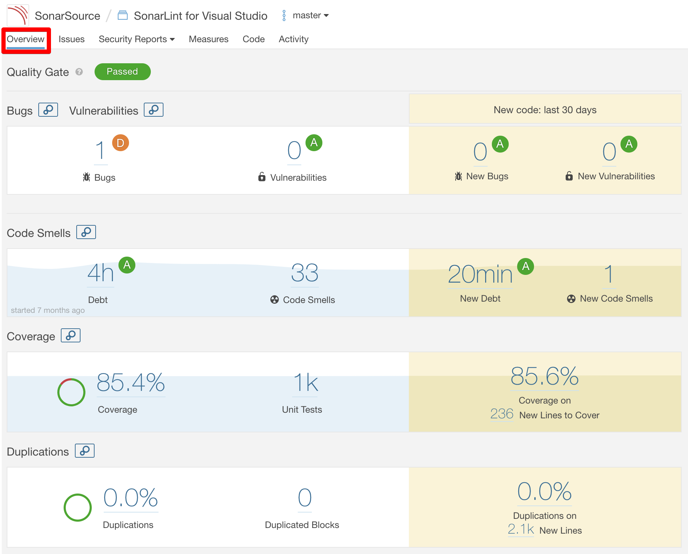

TOOL
=====

개발 환경 툴


[Flyway](https://flywaydb.org/)
=====

- [**(출처) Flyway 로 Java 에서 DB schema, seed 관리하기/강남언니 공식 블로그**](https://blog.gangnamunni.com/post/introducing-flyway)

- DB schema 를 코드로 관리한다는 것
   - 목표
      - 현재 DB schema 를 코드로 옮긴다
      - 앞으로 DB schema 변경을 코드로 관리한다
      - 배포 시에 Flyway 를 이용해 DB migration 을 수행한다
      - local 환경 작업을 위한 seed 를 코드로 관리한다

   - 작업
      - Flyway 설치 및 설정
      - 현재 DB schema 를 기준으로 migration 파일 생성
      - seed 파일 생성

- 실행 벙법
   - `Spring Boot On-Startup`, `CLI`, `API`, `Maven`, `Gradle`, `Ant`, `SBT`

- `Spring Boot On-Startup`
   - 설정 파일 (application.yml)

   ```
   spring:
     flyway:
       enabled: true
       url: jdbc:h2:mem:mydb
       user: sa
       password:
       baseline-on-migrate: true
       baseline-version: 0
       locations: classpath:db/migration/{category},filesystem:/opt/migration/{category}
   ```

- `CLI`
   - 설정 파일 (외부 설정 파일)

   ```
   # ./src/main/resources/flyway_{category}.conf
   
   flyway.url=jdbc:h2:mem:mydb
   flyway.schemas={schemas}
   flyway.user=sa
   flyway.password=
   flyway.locations=filesystem:src/main/resources/db/migration/{category}
   ```

   - 실행 (migrate)

   ```
   $ flyway -configFiles=./src/main/resources/flyway_{category}.conf migrate
   ```


[Docker compose](https://docs.docker.com/compose/)
=====

- [**(출처) Docker Compose 로 local 개발 환경 쉽게 관리하기/강남언니 공식 블로그**](https://blog.gangnamunni.com/post/docker-compose-for-local-env)
      
- Docker Compose 는 간단하게 여러 Docker application 들을 어떻게 실행할지 정의하고 실행할 수 있는 툴이다.

- 예제

   ```
   # docker-compose.yml
   
   version: '3'
   
   services:
     database:
       image: mysql:5.7.27
       ports:
         - 43306:3306
       environment:
         MYSQL_ROOT_PASSWORD: password
       command: [ '--character-set-server=utf8mb4', '--collation-server=utf8mb4_unicode_ci' ]
     redis:
       image: redis:5.0.5
       ports:
         - 46379:6379
     influxdb:
       image: influxdb
       ports:
         - 48086:8086
   ```

- 장점
   - 띄우고 내리는 등의 행위가 편하다
   - Docker 환경이 파일로 관리된다
   - 협업 하는 모두가 명령어 하나로 쉽게 같은 환경을 사용할 수 있게 된다


[Sonarqube](https://www.sonarqube.org/)
=====

- [**(출처) 코드 분석 및 코드 품질 향상/아빠프로그래머님 블로그**](https://daddyprogrammer.org/post/817/sonarqube-analysis-intergrated-intellij/)

- 목차
   - 소나큐브 서버 실행
   - 소나큐브 웹 어드민
   - 기능 업데이트
   - 유저 관리
   - 그룹 관리
   - Intellij 연동
   - 정적 파일 분석
   - SonarQube 서버에서 정적 분석 하기

- SonarQube Dashboard
   
   


[AQueryTool](http://aquerytool.com/)
=====

- [**가이드**](https://aquerytool.com/help/index/)

- AQueryTool은 웹 기반 ERD 툴 + SQL 자동 생성 프로그램
   - Join, Paging 을 포함해 다양한 SQL 문을 자동으로 생성
   - 테스트 데이터를 자동으로 생성
   - Java, C#, Javascript 모델도 자동으로 생성
   - from SQL to ERD (Reverse Engineering)
   - from ERD to SQL

- 젊은 ERD 툴

