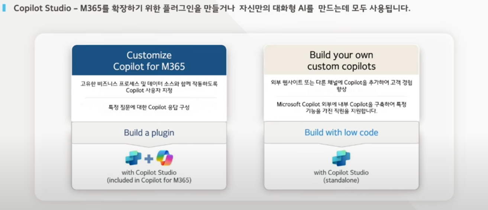
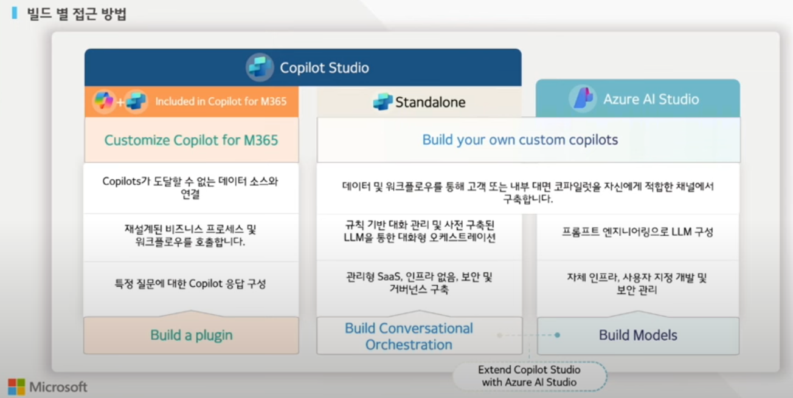
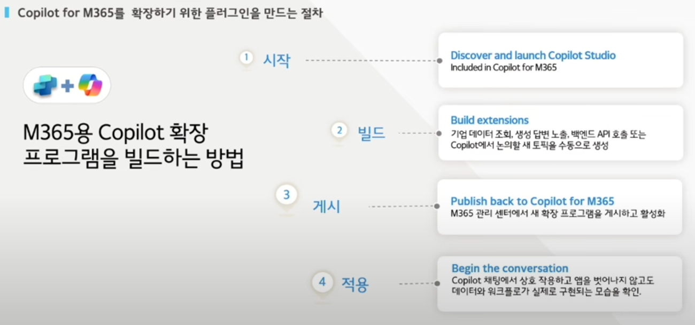
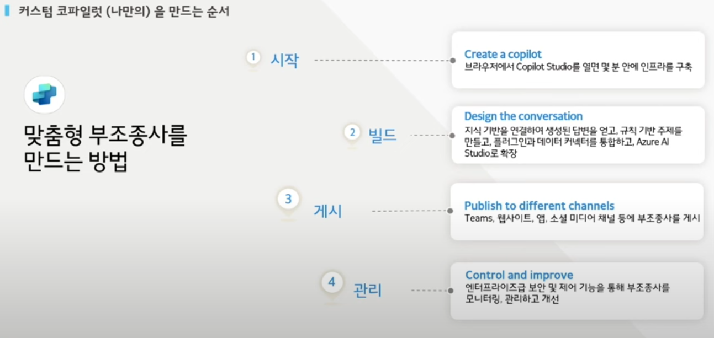

**Copilot Studio**는 GitHub의 AI 도구인 **Copilot**을 확장한 **맞춤형 AI 워크플로우 설계 및 통합 플랫폼**입니다. 주로 소프트웨어 개발자와 팀이 **자체적인 AI 기반 작업 흐름을 설계**하고, 이를 **프로젝트와 긴밀히 통합**할 수 있도록 돕습니다.

---

- **Copilot, MS 365 Copilot, Copilot Studio**

- [**(출처) 유투브/쎄엔토트**](https://www.youtube.com/watch?v=f6qox6k-Mng)
