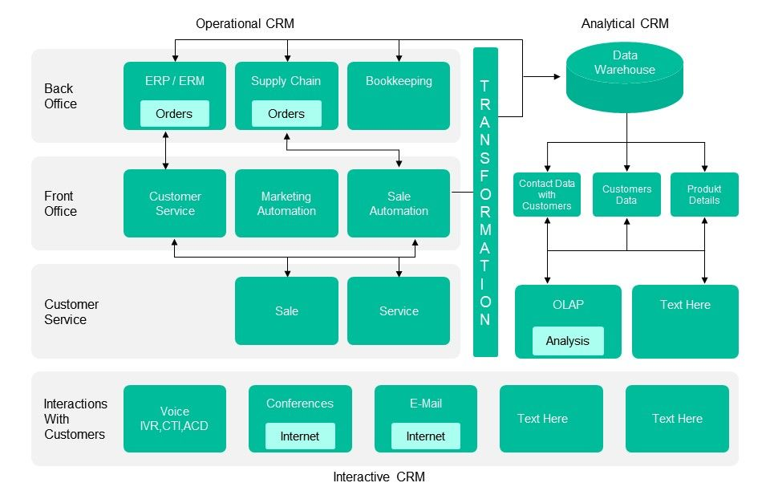
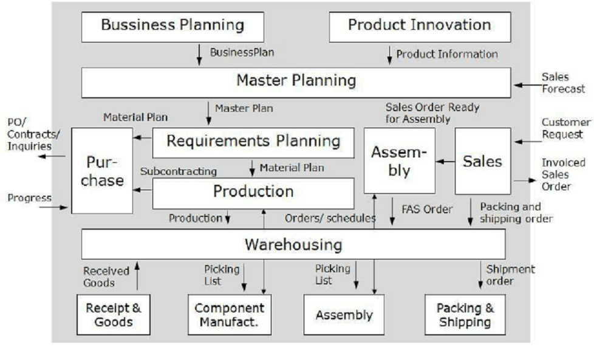
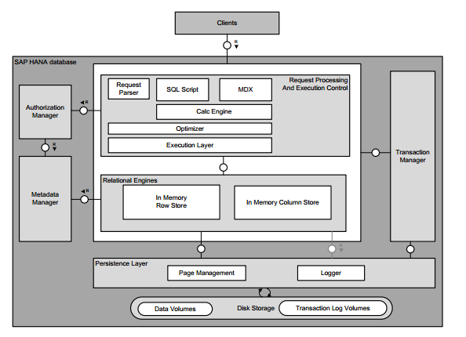

고객 관계 관리 솔루션
=====

 - `SAP`: Systems, Applications, and Products in Data Processing
 - `CRM`: Customer Relationship Management
 - `ERP`: Enterprise Resource Planning
 - `SFA`: Sales Force Automation
 
## CRM vs. ERP

- CRM 시스템의 주요 사용자는 영업과 지원 조직이다. 이들은 본질적으로 고객을 대면할 뿐, 주문 생성과 처리 실무는 하지 않는다.
- ERP 사용자는 공장 관리자, 생산 일정 관리자, 구매자, 공급망 관련자, 재무 관련자 등의 위젯 생산 절차와 실행 계획에 집중한다.
- ERP 사용자들은 내부자와 공급자를 대면하고, 모종의 불만에 대응할 때 이외에는 고객과 통화하는 경우가 거의 없다.

## CRM

## ERP

## SAP

- 코어 모듈
   - `FI` (Finalcial, 일반회계)
   - `CO` (Controlling, 관리회계)
   - `MM` (Material Management, 자재관리)
   - `SD` (Sales and Distribution, 영업관리)
   - `PP` (Production Planning, 생산관리)
   - `BC` (Basic Component)

- SAP 제품 구성
   - `SAP NetWeaver`: SAP시스템의 소위 기술적 기반 (technical platform). ERP를 NetWeaver 위에 설치하는 개념으로 이해
   - `SAP Web AS`: NetWeaver 의 옛날 버전 이름. AS는 Application Server
   - `SAP R/1 ~ R/3`: 현재 ERP ECC의 옛날 버전 이름
   - `ECC (ERP Central Component)`: 통칭 SAP ERP라고 부르는 제품
   - `EP (Enterprise Portal)`: ERP와 사용자를 연계하는 웹 포털
   - `BW (business warehouse) / BI (business intelligence)`: ERP를 이용한 정보 추출, 리포팅에 강점
   - `PI (Process Integration)`: 이전에는 XI (Exchange Infrastructure)라고 부르던 제품의 업그레이드 제품. non SAP 시스템과의 데이터 연계를 담당
   - `SAP HANA`: SAP에서 개발한 in-memory 방식의 RDBMS (가끔 HANA DB 기반 프레임워크를 의미)
   - `Solman(Solution Manager)`: SAP 서포트 패키지를 SAP Service Market Place (SMP)에서 내려받을 수 있도록 승인하는 역할
   - `SAProuter`: 모듈이나 오브젝트를 수정하는 Note를 자동으로 내려받아 적용할 수 있음. 또한 ERP에 심각한 문제가 있을 때 SAP으로부터 원격지원을 받을 수 있음.

- SAP HANA

