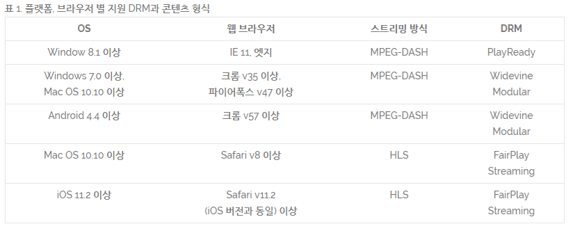

AI 기술을 통한 음원 플랫폼 개인화
=====

- **AI** 기반의 다양한 **큐레이션** (개인화 추천) 서비스
- **타깃 세그먼트 기반** 큐레이션 서비스가 제공되었던 초기단계
- 세그먼트를 넘어 **초개인화 큐레이션 시대**가 도래한 현재
   - 나와 비슷한 성향의 사용자가 좋아하는 상품을 나에게도 추천해주는 협업 필터링 **(CF, Collaborative Filtering)**
   - 콘텐츠의 특성과 고객 프로파일 비교를 통해 선호 콘텐츠를 제공하는, 콘텐츠 기반 필터링 **(Content Based Filtering)**
      - 콘텐츠 자체를 분석한 프로파일과 고객의 선호도를 추출한 프로파일 두 정보간의 유사성을 분석
   - 고객 행동에 기반하여 점수를 메기는 단순 **룰 베이스 방식의 추천**
      - 상품들의 이력을 바탕으로 단순히 1점씩 매기고 점수가 높은 순으로 추천
   - Accuracy, Precision, Recall, F1-score 등을 활용 **추천 결과 평가**

[출처] - [뷰저블](https://www.beusable.net/blog/?p=1332)

### [멜론]
- 현재 보유곡은 4000만곡, 이용자는 878만명, 월간 활성 사용자수 (MAU)는 638만8000여명. 멜론은 이용자 한 명 한 명의 **취향**을 강조
- 2004년부터 축적한 빅데이터를 바탕으로 머신러닝 추천 시스템, 멜론과 이용자가 함께 만든 플레이리스트를 기반으로 탄탄한 추천 라인업을 제공
- 멜론 어플의 첫 화면에는 **OO님이 좋아할 음악**을 통해 `데일리 믹스`를 선보임. **이용자의 감상 이력과 선호도, 클릭 이력 등 데이터를 기반한 음악 추천 결과를 첫 화면에 노출해 개인별 맞춤 서비스를 쉽게 이용**
- 실시간 감상 이력을 바탕으로 방금 들은 곡의 느낌을 이어가도록 유사한 곡을 추천하는 `유사곡 믹스`

### [지니뮤직]
- 마치 타임머신을 타고 과거로 돌아간 듯 그 당시 자신이 즐겨 듣던 50곡의 음악 목록을 추천해주는 `그때 당신이 즐겨 듣던` 서비스
- 실시간 대화형 음악 추천 서비스 `뮤직허그`는 아날로그 감성을 살린 일반인 DJ의 추천 서비스로 이용자들은 DJ와 실시간으로 채팅을 하며 DJ가 선곡해 추천하는 음악을 감상
- 최근 감상한 노래를 기반으로 유사한 장르나 아티스트의 음악을 추천해주는 `감상 이력의 재발견` 서비스
- **뮤직 컬러 아이덴티티 (MCI·Music Color Identity) 큐레이션**을 도입. 현재 현재 서비스 중인 총 2000만곡 이상의 음원에 333가지 컬러와 매칭
- 모든 음악을 장르, 분위기, 리듬, 음색, 스타일, 감정에 따라 분석해 `시드 데이터 베이스 (seed data base)` 구축

### [플로]
- 음악 플랫폼 플로는 일찌감치 소비자의 세밀한 취향 분석에 집중함
- 이용자의 청취 이력과 **좋아요** 등의 축적된 데이터를 통해 딥러닝 기술과 음원 분석 기술, AI를 활용해 소비자의 취향에 맞는 음악을 추천

[출처] - [기사](http://news.heraldcorp.com/view.php?ud=20210217000716)

고객 빅데이터 기반 사용자경험 (UX) 적용
=====

- 고객 여정을 획기적으로 줄여주는 개인화 추천 UX
- 개인화 추천 UX는 고객이 수십 개의 페이지를 거치지 않아도 즉각적으로 원하는 행동을 취할 수 있도록 함

[출처] - [뷰저블](https://www.beusable.net/blog/?p=1359)

음악 메타 데이터베이스 (DB) 구축
=====

- ID3 메타 데이터라고도하는 음악 메타 데이터는 콘텐츠를 식별하는 데 사용되는 오디오 파일에 포함 된 정보
   - 노래의 제목
   - 밴드 또는 아티스트 이름
   - 노래가 시작된 앨범 이름
   - 음악의 종류 (장르)
   - 앨범 트랙 번호
   - 노래가 발표 된 해

음원 유통 및 IP 관리를 위한 시스템 운영
=====

- 음원 콘텐츠 IP (지식재산권) 사업
- 음원 판매 마켓 ICT 플랫폼
- **블록체인 기술을 바탕**으로 한 보안 시스템을 통해 안전히 보관

[출처] - [비트썸원](https://beatsomeone.com/ko)

ExoPlayer
=====

- 구글에서 만든 미디어 재생 라이브러리로, 다양한 종류의 미디어 파일을 쉽게 재생할 수 있도록 도와줌. 
- 별 다른 설정 없이도 네트워크로부터 미디어를 스트리밍 형태로 불러와 재생할 수도 있고 다양한 포맷들을 지원하며 커스터마이징도 지원함.
- 대표적인 서비스에는 **Youtube**가 있음.
- 라이브러리이므로 앱을 업데이트하여 새로운 기능을 쉽게 사용할 수 있음.
- **Adaptive Stremaing**
   - **DASH** (MPEG-DASH): 국제 표준화된 최초의 적응 비트레이트 HTTP 기반 스트리밍 솔루션
   - **HLS** (Apple-HLS): 애플에서 만든 스트리밍 솔루션
   - **SmoothStreaming** (Microsoft-SmoothStreaming): MS에서 만든 스트리밍 솔루션
- 안드로이드 지원 포맷 (**Audio**)
   - AAC LC - .3gp, .mp4, .m4a, .aac, .ts
   - HE-AACv1 (AAC+) - .3gp, .mp4, .m4a, .aac, .ts
   - AAC ELD - .3gp, .mp4, .m4a, .aac, .ts
   - AMR-NB - .3gp
   - AMR-WB - .3gp
   - FLAC - .flac
   - GSM - .gsm
   - MIDI - .mid, .xmf, .mxmf, .rttl, rtx, .ota, .imy
   - MP3 - .mp3
   - Opus - .mkv
   - PCM/WAVE - .wav
   - Vorbis - .ogg, .mkv
- 안드로이드 지원 포맷 (**Video**)
   - H.263 - .3gp, .mp4
   - H.264 (BP) - .3gp, .mp4, .ts
   - H.264 (MP)
   - H.265 (HEVC) - .mp4
   - MPEG-4 SP - .3gp
   - VP8 - .webm
   - VP9 - .webm

와이드바인 (Widevine)
=====

 - 구글 크롬 및 파이어폭스 웹 브라우저 (및 일부 파생 제품), 안드로이드의 안드로이드 미디어 DRM (Android MediaDRM), 안드로이드 TV 및 기타 전자통신 기기에서 사용하는 구글의 몇 안되는 **독점 디지털 권한 관리 (DRM) 기술**이다. 
 - 다양한 암호화 체계와 하드웨어 보안을 지원하여 콘텐츠 소유자가 정의한 규칙에 따라 분산된 비디오 콘텐츠에 대한 **소비자 액세스를 관리 또는 제한**한다. 
 - 주로 구글 크롬 및 기타 브라우저 및 장치의 클라이언트로 **CDM** (Content Decryption Module)을 제공한다. 
 - 콘텐츠 제공 업체에서 무료로 사용할 수 있으며 라이선스 생성 또는 장치 통합에 대한 비용을 청구하지 않는 **무료 소프트웨어 제품**이다.
 

미디어 게이트웨이 (Media Gateway)
=====

- 서로 다른 유형의 네트워크를 연결하기 때문에 주요 기능 중 하나는 **서로 다른 전송 및 코딩 기술 간**에 변환하는 것
- 주로 패킷 음성 전달망에서 **회선 (circuit) 망**의 **시분할 다중화 (TDM: Time Division Multiplexing) 트래픽**을 **패킷망**의 **ATM 혹은 IP 트래픽** 변환으로 사용되는 관문 역할을 수행

IPTV 개요
=====

- IPTV(Internet Protocol Television)는 망 하부구조 위에 인터넷 프로토콜을 통해 전달되는 디지털 TV 서비스를 뜻한다. 일반적으로 가입자에게 VoD(Video on Demand)와 같은 서비스와 웹 서비스, VoIP(Voice over IP) 등이 같이 제공되는 형태가 일반적이며 이를 Triple Play라고 지칭한다. IPTV는 일반적으로 폐쇄된 망 을 소유하고 있는 방송 운영자로부터 제공되는데, 공개된 인터넷 망에서 컨텐츠를 제공하는 인터넷 TV와는 또 다른 개념이다. IPTV는 라이브 TV(멀티캐스팅 기반)와 저장된 비디오(VoD) 서비스를 동시에 제공하는데, IPTV를 이용하기 위해서는 셋탑박스 또는 PC가 요구되며, MPEG2 또는 MPEG4로 코딩된 컨텐츠가 망을 통해 유니캐스트 또는 멀티캐스트로 전달된다. 

- 국내에서는 기술적인 문제보다도 기존 케이블 사업자와의 역할 정립 등 외적인 문제가 걸림돌이 되고 있는데, 정보통신부에서는 유선방송사업자와 통신사업자간 역무 분담을 위해 2005년 2월 IPTV가 아닌 ICOD(Internet Contents on Demand)라는 용어를 권고한 바 있으며, 2006년 11월부터 2개 컨소시엄에서 시범 서비스를 하도록 하용하고 있는데, C-큐브 컨소시엄에는 KT, 하나로 텔레콤, LG 데이콤, SK 텔레콤, 온세통신, 삼성전자, KBS, MBC, SBS, EBS 등 52 개 업체가 참여 중이고, 다음 컨소시움에는 다음커뮤니케이션, 컨텐츠플러그, 디보스, KBS 등 10개 업체가 참여 중이다.

IP 멀티캐스트
=====

- IP 멀티캐스트(multicast)를 위한 호스트(host)의 확장은 RFC 1112에 정의되어 있다. 여기서 IP 멀티캐스트를 IP 데이터그램을 하나의 목적지 주소로 식별되는 또는 그 이상의 호스트들로 구성되는 “호스트 그룹”으로 보내는 것으로 정의했으며, 이때 하나의 멀티캐스트 데이터그램은 일반 IP 데이터그램과 동일하게 모든 목적지 그룹 구성원들에게 각각 "best-efforts" 안정성을 가지고 전달된다. 이러한 호스트 그룹의 구성은 동적으로 이루어지며, 호스트들은 언제라도 하나의 그룹에 합류(join)할 수도 있고, 떠날(leave) 수도 있다. 이때 호스트 그룹에 위치나 전체 구성원의 수에 대한 제한은 없다. 또한 하나의 호스트는 동시에 여러 그룹에 속할 수도 있으며, 이러한 그룹에 데이터를 보내기 위해 반드시 그룹 구성원이 될 필요는 없다. 

- IP 멀티캐스트 데이터그램의 전달 기능은 "멀티캐스트 라우터"(multicast router)에 의해 처리되는데, 이것은 인터넷 게이트웨이(gateway)와 같이 존재하거나 따로 존재할 수 있다. 하나의 호스트는 지역 망 멀티캐스트로 데이터그램을 보내는데, 이것은 직접적으로 연결된 모든 호스트들에게 도달한다. 만약 데이터그램의 TTL(time-to-live) 값이 1보다 크게 설정되어 있는 경우, 지역 망에 연결되어 있는 멀티캐스트 라우터(들)은 목적지 그룹에 속한 구성원을 가지고 있는 모든 다른 망에게 이것을 전달할 책임을 진다. IP TTL 이내에서 도달할 수 있는 모든 망에서 멀티캐스트 라우터가 지역 망 멀티캐스트를 이용하여 이를 전달한다. 

- 이러한 표준에 적합하는 호스트의 레벨은 3가지가 있는데, 레벨 0은 멀티캐스트를 지원하지 않는 것을 뜻하고, 레벨 1은 IP 멀티캐스트 데이터그램을 보내기는 하지만 수신은 할 수 없는 것을 뜻하고, 레벨 2는 IP 멀티캐스트를 전체 지원하는 것을 뜻한다. 현재 IP 멀티캐스트 주소는 클래스 D 주소로 식별되는데, 이것의 상위 4개 비트는 “1110”을 갖는다. 이것을 일반적인 IP주소 표기법으로 나타내면 224.0.0.0에서 239.255.255.255 범위를 갖는다. 이때 224.0.0.1은 모든 IP 호스트들로 구성되는 영속적인 그룹으로 정의되어 있는데, 이것은 망에 직접적으로 연결된 모든 호스트를 의미하며, 전 세계 인터넷의 모든 호스트를 위한 멀티캐스트 주소는 존재하지 않는다.

Broadcast: One-to-all
=====

방송은 단일 소스에서 한 번에 모든 사람에게 신호를 보내고 네트워크 범위 내에 수신기가 있는 사람은 콘텐츠를 볼 수 있다. 라이브 콘텐츠 배포를 위해 **텔레비전 방송국과 케이블 TV 채널**에서 주로 사용하는 방송 방식의 가장 큰 장점은 대규모 청중에게 다가갈 수 있다는 것이다.

Unicast: One-to-one
=====

브로드캐스트 전송과 달리 유니캐스트는 인터넷을 통해 스트림을 전달하기 위해 TCP(전송 제어 프로토콜)를 사용하는 일대일 연결이다. 사용자는 서버, 웹사이트 또는 다른 사용자에게 정보를 요청하고 상대방은 고유한 연결을 설정한 후 정보를 보낸다. 유니캐스트는 콘텐츠를 원할 때마다 무엇이든 시청할 수 있는 온디맨드에 적합하다. **OTT** 또는 Over Top 서비스는 스마트폰, 태블릿, SmartTV 및 기타 인터넷 연결 장치로 라이브 비디오를 스트리밍하기 위해 유니캐스트에 의존한다.

Multicast: One-to-many
=====

멀티캐스트는 기존 방송과 유사한 IP 방식을 통한 일대다 스트리밍이다. 멀티캐스트는 LAN(Local Area Network) 또는 IP 서비스 공급자의 자체 네트워크와 같은 폐쇄된 IP 네트워크를 통해 스트림을 "브로드캐스팅"하기 위해 UDP (사용자 데이터그램 프로토콜)를 사용한다. 라이브 TV의 멀티캐스트 스트리밍은 일반적으로 **IPTV** 라고 하는 반면 OTT는 인터넷을 통한 유니캐스트이다.
