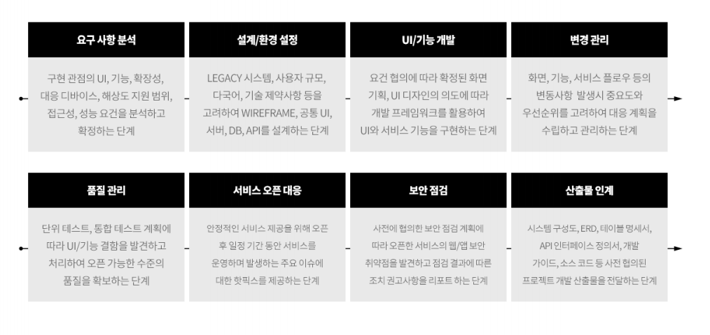

[개발 계획서]
=====

# # 추진 배경
1. 개요
1. 배경

 

# # 추진 방안
1. 범위
1. 서비스 구성도
1. 구축 방안
1. 시스템 구성도
1. 소프트웨어 구성도
1. 시나리오 분석
1. 상세 개발 방안

 

# # 추진 계획
1. 일정
1. 투입 인력

 

[프로젝트 킥오프]
=====

# # 추진 개요
1. 계획
1. 체계
1. 범위

 

# # 추진 방향
1. 1..3

 

# # 차별화 설계 포인트
1. 1..5

 

# # 주요 구축 방안
1. 1..5
1. 프로젝트 조직 및 인력
1. 추진 일정

 

# # 기대 효과
1. 1..3

 

# # Appendix
1. 1..3

 

[제안서]
=====

# # 업체 현황
1. 일반 현황
1. 재정 현황
1. 유관 사업 수행 실정

 

# # 비지니스 협력 관련
1. 플랫폼 유지 관리 계획
1. 일정 계획
1. 수행 조직 계획

 

# # 기술적 사업 추진 역량
1. 제품 개발비 산정 내역
1. 제품 개발 방법론
1. 적용 기술셋 확보 수준
1. 제품 개발 및 유지보수 인력 구성

 

# # 부가 사항
1. 제안사 강점
1. 신규 BM 추가 제안

 

# # 상세 기술요구사항 답변
1. 기능요구사항 명세

 

[솔루션 소개]
=====

# # 시장 동향
1. 1..3

 

# # 솔루션 소개
1. 개요
1. 시스템 구성
1. 제공 기능
1. 기본 서비스 시나리오
1. 기대 효과

 

# # 활용 사례
1. 1..3

 

[프로젝트 수행]
=====

[프로젝트 운영]
=====

# # 사업 개요

# # 상세 내역

# # 소요 예산
1. OPEX (Operating Expenditure): 운영 지출
1. CAPEX (Capital Expenditure): 자본적 지출
