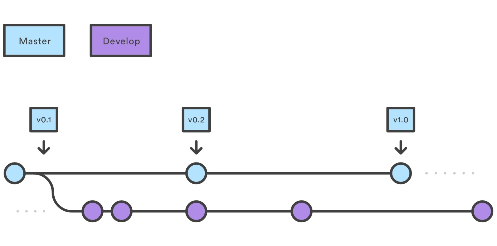
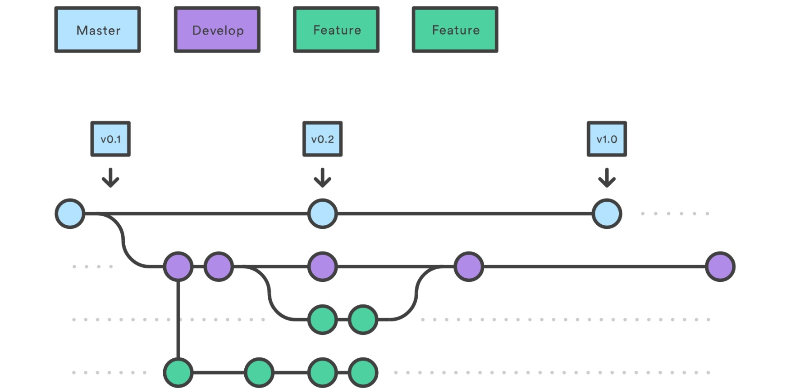
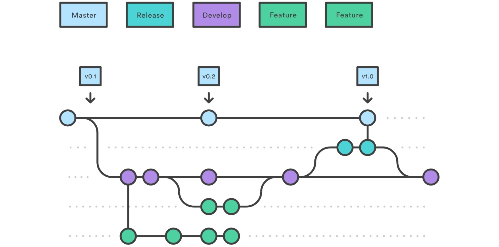
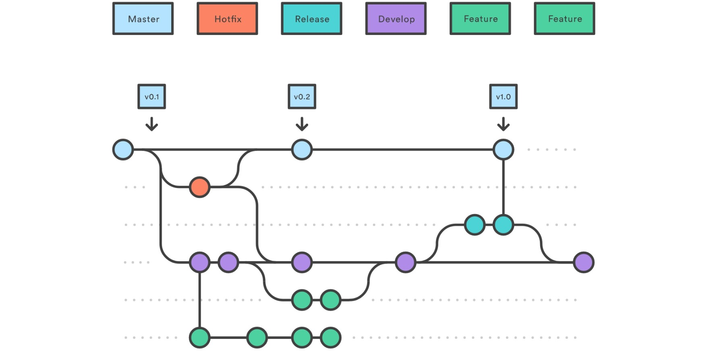

GIT
=====

## 1. 최초 설정

### 사용자 정보 수정
```
git config --global user.name "blabla"
git config --global user.email "blabla@gmail.com"

git config --local user.name "blabla"
git config --local user.email "blabla@gmail.com"
```

### 설정 확인
```
git config --system --list # System 설정 파일을 확인하고 싶다면
git config --global --list # Global 설정 파일을 확인하고 싶다면
git config --local --list # Local 설정 파일을 확인하고 싶다면
git config --list # 모든 설정을 확인하고 싶으면
```

## 2. 저장소 관리

### 기존 디렉토리를 저장소로 만들기
```
git init
```

### 원격지 저장소 생성 및 브랜치 생성
```
git remote add origin https://github.com/id/project.git
git push -u origin master
```
- `origin`: 원격지 저장소명
- `master`: 브랜치명

### 원격지 저장소 확인
```
git remote
```

### 기존 저장소를 복제
```
git clone -b master https://github.com/id/project.git # git clone https://github.com/id/project.git 
git log
```

## 3. 파일 버전 관리

### 소스 추가 및 커밋
```
git add -A 
git add README.md
git add .
git commit -m "first commit"
```

### 상태 확인
```
git status
```

### 원격지 브랜치에서 가져오기
```
git pull origin <branch_name>
```

### 원격지 브랜치에 반영하기
```
git push origin <branch_name>
```

### 수정된 브랜치를 원격지에 반영
```
git push origin -u <new_name>
```
- `-u` 옵션은 현재 브랜치를 자동으로 origin이라는 원격지 저장소의 브랜치에 연결. 연결 후 `git push`, `git pull` 단축 명령어 사용 가능함.

## 4. 브랜치 관리

### 브랜치 전환
```
git checkout -b <branch_name>
```
- `-b` 옵션을 넣으면 브랜치 작성과 체크아웃을 한꺼번에 실행함.

### 브랜치 리스트 동기화
```
git fetch -p
```
### 원격지 브랜치 삭제 (방법 #1)
```
git push origin --delete <old_name>
```

### 원격지 브랜치 삭제 (방법 #2)
```
git branch -d <old_name>
git push origin <old_name>
```

### 로컬에서 브랜치 삭제 (merge하지 않은 커밋이 있으면 삭제 불가)
```
git branch -d <old_name>
```

### 로컬에서 브랜치 삭제 (대문자 -D 옵션은 강제 삭제)
```
git branch -D <old_name>
```

### 로컬에서 브랜치명 수정
```
git branch -m <new_name>
```

### 브랜치 리스트 확인
```
git branch -a
```

### 꼬리표 달기
```
git tag 1.0.0 1b2e1d63ff
```
- `1b2e1d63ff` 부분은 꼬리표가 가리킬 확정본 식별자임. `git log` 명령으로 확정본 식별자를 얻을 수 있음.

Git-flow Workflow
=====

1. `master` : 제품으로 출시될 수 있는 브랜치
1. `develop` : 다음 출시 버전을 개발하는 브랜치
1. `feature` : 기능을 개발하는 브랜치
1. `release` : 이번 출시 버전을 준비하는 브랜치
1. `hotfix` : 출시 버전에서 발생한 버그를 수정 하는 브랜치

### Develop and Master Branches
```
git branch develop # 생성
git push -u origin develop # 원격 브랜치 연결
```



### Feature Branches
```
git checkout develop # 전환
git checkout -b feature_branch # 피쳐 브랜치 생성 후 feature 개발

git checkout develop # 전환
git merge feature_branch # 병합
```



### Release Branches
```
git checkout develop # 전환
git checkout -b release/0.1.0 # 릴리즈 브랜치 생성 후 병합

git checkout master # 전환
git merge release/0.1.0 # 병합

git checkout develop # 전환
git merge release/0.1.0 # 병합

git branch -d release/0.1.0 # 제거
```



### Hotfix Branches
```
git checkout master # 전환
git checkout -b hotfix_branch # 버그 브랜치 생성 후 bug fix

git checkout master # 전환
git merge hotfix_branch # 병합

git checkout develop # 전환
git merge hotfix_branch # 병합

git branch -D hotfix_branch # 제거
```



설치 프로그램
=====
- [**OS X용 git 다운로드**](http://git-scm.com/download/mac)
- [**Windows용 git 다운로드**](https://gitforwindows.org/)

Commit 메시지 포맷
=====
- 포맷

```
{type}/#{task/issue-id} - 커밋한 내용 설명
```

- 타입

```
types = {
  feat : 새로운 기능에 대한 커밋
  fix : 버그 수정에 대한 커밋
  build : 빌드 관련 파일 수정에 대한 커밋
  chore : 그 외 자잘한 수정에 대한 커밋
  ci : CI 관련 설정 수정에 대한 커밋
  docs : 문서 수정에 대한 커밋
  style : 코드 스타일 혹은 포맷 등에 관한 커밋
  refactor :  코드 리팩토링에 대한 커밋
  test : 테스트 코드 수정에 대한 커밋
}
```
