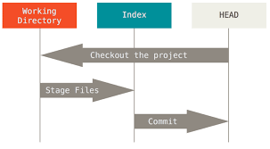
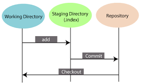

GIT
=====


## GIT 이해하기

- wd, index, head


- working directory, staging directory, repository


- git component


## 1. 최초 설정

### 사용자 정보 수정
```
git config --global user.name "blabla"
git config --global user.email "blabla@gmail.com"

git config --local user.name "blabla"
git config --local user.email "blabla@gmail.com"
```

### 설정 확인
```
git config --system --list # System 설정 파일을 확인하고 싶다면
git config --global --list # Global 설정 파일을 확인하고 싶다면
git config --local --list # Local 설정 파일을 확인하고 싶다면
git config --list # 모든 설정을 확인하고 싶으면
```

### Alias
```
git config --global alias.adog "log --all --decorate --oneline --graph"
```


## 2. 저장소 관리

### 기존 git 정보를 삭제
```
rm -rf .git
```

### 기존 디렉토리를 저장소로 만들기
```
git init
```

### 원격지 저장소 생성 및 브랜치 생성
```
git remote add origin https://github.com/id/project.git
git push -u origin master
```
- `origin`: 원격지 저장소명
- `master`: 브랜치명

### 원격지 저장소 확인
```
git remote
```

### 기존 저장소를 복제
```
git clone -b master https://github.com/id/project.git # git clone https://github.com/id/project.git 
git log
```


## 3. 파일 버전 관리

### 소스 추가 및 커밋
``` 
git add README.md
git add .
git commit -m "first commit"
```

### 상태 확인
```
git status
```

### 원격지 브랜치에서 가져오기 (1)
```
git fetch origin <branch_name>
```

### 원격지 브랜치에서 가져오기 (2)
```
git pull origin <branch_name>
```

### 원격지 브랜치에 반영하기 (1)
```
git push origin <branch_name>
```

### 원격지 브랜치에 반영하기 (2)
```
git push origin -u <new_name>
```
- `-u` 옵션은 현재 브랜치를 자동으로 origin이라는 원격지 저장소의 브랜치에 연결. 연결 후 `git push`, `git pull` 단축 명령어 사용 가능함.


## 4. 브랜치 관리

### 브랜치 전환
```
git checkout -b <branch_name>
```
- `-b` 옵션을 넣으면 브랜치 작성과 체크아웃을 한꺼번에 실행함.

### 브랜치 병합
```
git merge <branch_name>
```

### 원격지 브랜치 삭제 (1)
```
git push origin --delete <old_name>
```

### 원격지 브랜치 삭제 (2)
```
git branch -d <old_name>
git push origin <old_name>
```

### 로컬에서 브랜치 삭제 (merge하지 않은 커밋이 있으면 삭제 불가)
```
git branch -d <old_name>
```

### 로컬에서 브랜치 삭제 (대문자 -D 옵션은 강제 삭제)
```
git branch -D <old_name>
```

### 로컬에서 브랜치명 수정
```
git branch -m <new_name>
```

### 브랜치 리스트 확인
```
git branch -a
```

### 기타
```
git rebase master # base를 master로 re-base 한다
git reset <option> <branch> # 커밋 취소 - branch 이후 기록을 없애자
git revert <branch> # 커밋 취소 - 수정한 기록은 남기자
git stash # 현재 작업하고 있는 작업을 따로 저장하기
git stash list stash # 목록을 확인할 수 있다
git stash apply # 가장 최근의 stash를 가져와 적용한다
```

### 꼬리표 달기
```
git tag 1.0.0 1b2e1d63ff
```
- `1b2e1d63ff` 부분은 꼬리표가 가리킬 확정본 식별자임. `git log` 명령으로 확정본 식별자를 얻을 수 있음.


Git-flow Workflow
=====

1. `master` : 제품으로 출시될 수 있는 브랜치
1. `develop` : 다음 출시 버전을 개발하는 브랜치
1. `feature` : 기능을 개발하는 브랜치
1. `release` : 이번 출시 버전을 준비하는 브랜치
1. `hotfix` : 출시 버전에서 발생한 버그를 수정 하는 브랜치

### Develop and Master Branches
```
git branch develop # 생성
git push -u origin develop # 원격 브랜치 연결
```


### Feature Branches
```
git checkout develop # 전환
git checkout -b feature_branch # 피쳐 브랜치 생성 후 feature 개발

git checkout develop # 전환
git merge feature_branch # 병합
```


### Release Branches
```
git checkout develop # 전환
git checkout -b release/0.1.0 # 릴리즈 브랜치 생성 후 병합

git checkout master # 전환
git merge release/0.1.0 # 병합

git checkout develop # 전환
git merge release/0.1.0 # 병합

git branch -d release/0.1.0 # 제거
```


### Hotfix Branches
```
git checkout master # 전환
git checkout -b hotfix_branch # 버그 브랜치 생성 후 bug fix

git checkout master # 전환
git merge hotfix_branch # 병합

git checkout develop # 전환
git merge hotfix_branch # 병합

git branch -D hotfix_branch # 제거
```


Github-flow Workflow
=====

`master` 브랜치만 존재


1. 기능개발, 버그 fix 등의 이유로 branch 생성 
1. 개발, 커밋
1. PR 생성
1. 리뷰
1. 테스트 환경 배포
1. master merge 후 push 하고 운영 환경 배포


Pull Request (PR) 보내는 방법
=====

1. 기여하려는 저장소를 fork
1. 내 컴퓨터에 저장소 clone
   - fork로 생성한 본인 계정의 저장소에서 **git clone** or download 버튼을 누르고 표시되는 url을 복사
   - `$ git clone https://github.com/<MY_ID>/<ORIGIN_REPO_NAME>.git`
1. 원격 저장소 remote 설정
   - clone 해 온 저장소에 원본 원격 저장소 설정. 즉, **내가 PR을 보낼 곳을 추가**
   - `$ git remote add upstream(별명) https://github.com/<ORIGIN_OWNER_ID>/<ORIGIN_REPO_NAME>.git`
1. PR용 branch 생성
   - `$ git checkout -b <PR_BRANCH_NAME>`
1. 코드 수정
1. PR용 branch에 push
   - `$ git push origin <PR_BRANCH_NAME>`
1. 본인 계정의 github 사이트에 들어가서 **PR 생성**
1. **PR 승인**이 되었다면 원본 원격 저장소와 동기화
1. PR용 branch 삭제
   - `$ git branch -D <PR_BRANCH_NAME>`
   - `$ git push origin --delete <PR_BRANCH_NAME>`

참조 - [**PR 보내는 방법/chanhuiseok님**](https://chanhuiseok.github.io/posts/git-3/)


설치 프로그램
=====
- [**OS X용 git 다운로드**](http://git-scm.com/download/mac)
- [**Windows용 git 다운로드**](https://gitforwindows.org/)
- [**소스트리 다운로드**](https://www.sourcetreeapp.com/)


Commit 메시지 포맷
=====
- 포맷

```
{type}/#{jira_no} - 개발 내용
```

- 타입

```
types = {
  feat:     새로운 기능에 대한 커밋
  fix:      버그 수정에 대한 커밋
  build:    빌드 관련 파일 수정에 대한 커밋
  chore:    그 외 자잘한 수정에 대한 커밋
  ci:       CI 관련 설정 수정에 대한 커밋
  docs:     문서 수정에 대한 커밋
  style:    코드 스타일 혹은 포맷 등에 관한 커밋
  refactor: 코드 리팩토링에 대한 커밋
  test:     테스트 코드 수정에 대한 커밋
}
```


그림으로 설명
=====

- [출처] - [**Git & GitHub Page/Tacademy**](https://tacademy.skplanet.com/live/player/onlineLectureDetail.action?seq=171)

- **파일 스테이지로 올리기 `git add [file]`**


- **스테이지에 있는 내용 커밋 `git commit -m "간단한 설명"`**


- **원격 저장소와 연결 `git remote add origin [url]`**


- **원격 자장소로 올리기 `git push origin master`**


- **원격 자장소 다운받기 `git clone [url]`**


- **기능별로 개발하기 `git branch [name]`**


- **브랜치 이동하기 `git checkout [name]`**


- **브랜치 합치기 `git merge [name]`**


- **브랜치 합치기 `git rebase master`**


- **브랜치 지우기 `git branch -d [name]`**


- **원격에서 기록 가져오기 `git fetch`**


- **원격에서 가져오고 합치기 `git pull`**


- **실수한 커밋을 RESET `git reset [option] [branch]`**


- **실수한 커밋 남기기 `git revert [branch]`**


- **현재 작업 보류 `git stash`**


