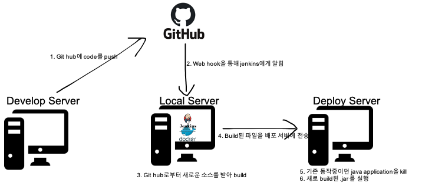

로컬 환경에 자동 배포 서버 구축하기
=====

- **환경**

   - Docker Desktop (https://docs.docker.com/docker-for-windows/install/)
   - Kitematic (https://github.com/docker/kitematic/releases)
   - IntelliJ IDEA 2021.1.3 (Ultimate Edition)
   - Jenkins
   - Github

- **구축 인프라**

   - jenkins를 통해 **CI (Test와 Build 자동화)**, plugin과 script를 통해 **CD (배포 자동화)** 구축

   

   1. local server에 docker를 이용해 jenkins 구동
   1. develop server에서 code push
   1. local server의 jenkins에서 github로부터 webhook을 받으면 이를 알아차리고 코드를 다운받고, test & build
   1. jenkins plugin (publish over ssh)를 이용해 배포서버에 자동으로 전달

- **Step 1 _ < Jenkins 설치 >**

   1. Kitematic을 통해 Docker Hub에서 Jenkins 검색
   1. 원하는 jdk가 설치된 Jenkins 컨테이너 설치 및 구동

- **Step 2 _ < GitHub Repository 생성 >**

   1. 간단한 Spring Boot Application 작성
   1. GitHub Repository 생성 및 소스 push

- **Step 3 _ < GitHub webhook 설정 >**

   1. Ngrok 설정
   1. github 설정
   1. jenkins item 생성

- **Step 4 _ < 원격지에 배포하기 >**

   1. Jenkins SSH Plungin 추가
   1. Jenkins Remote Server 추가
   1. Jenkins Item에 Remote 배포 설정 추가

- **Step 5 _ < 테스트 >**

   1. jenkins 콘솔 출력 확인
   1. 브라우저로 어플리케이션 페이지 학인

AWS 환경에 자동 배포 서버 구축하기
=====

[**출처 - 로컬 PC에 CICD 구축하기 (Jenkins, Ngrok, docker)/전준엽님**](https://galid1.tistory.com/743)

[**출처 - Jenkins와 CodeDeploy를 이용한 AWS에 CICD 구축하기/전준엽님**](https://galid1.tistory.com/746) 
