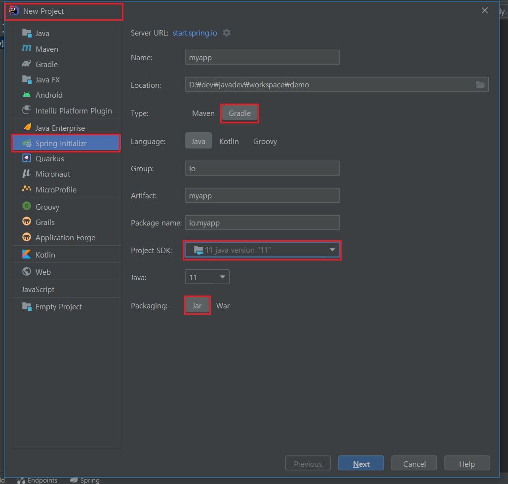
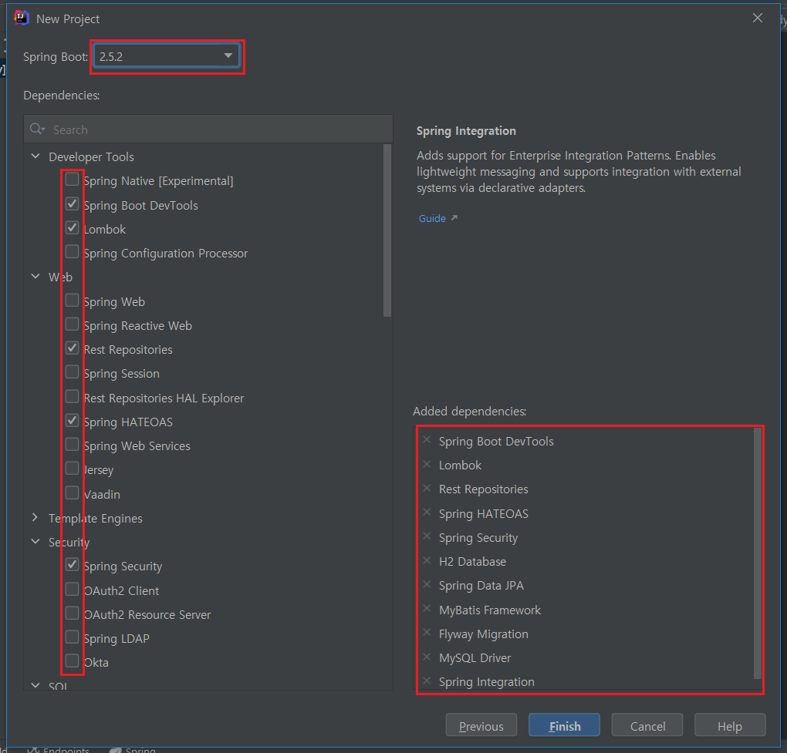
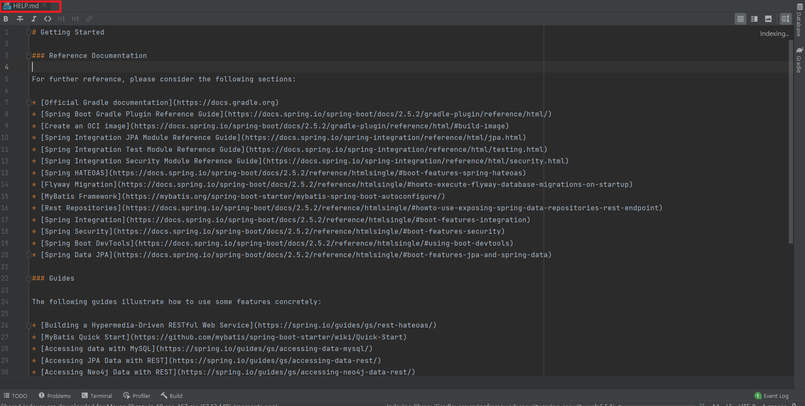
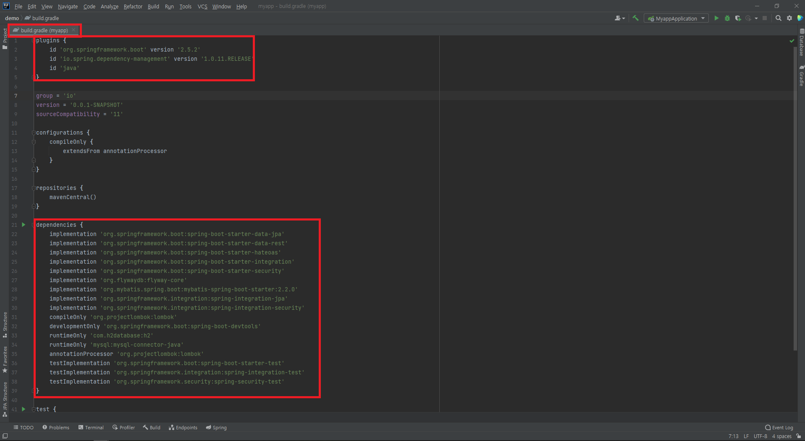
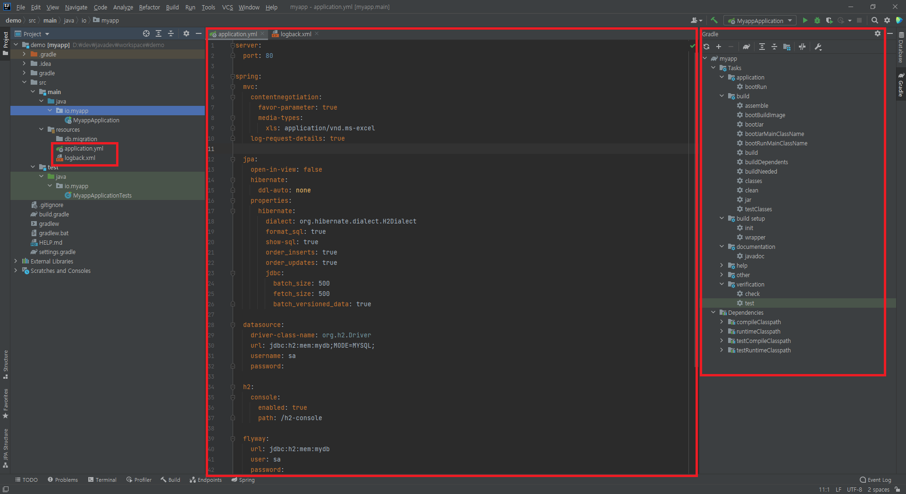
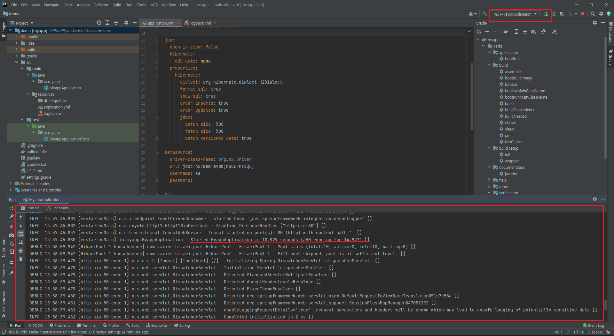
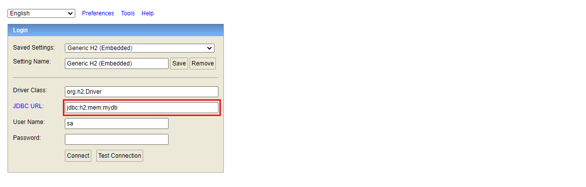

IntelliJ + Gradle + SpringBoot
=====

- **환경**

   - IntelliJ IDEA 2021.1.3 (Ultimate Edition)
   - java version 11
   - gradle version 7.0.2
   - spring boot version 2.5.2
   - H2 1.4

- **Step 1**

1. New Project 선택
1. Spring Initializr 선택
1. Type `Gradle` 선택
1. SDK java `11` 선택
1. Packaging `jar` 선택 (Standalone App으로 구동)

- **Step 2**

1. Spring Boot 버전 선택 (최신)
1. Dependencies 선택

- **Step 3**

1. 레퍼런스 문서 확인

- **Step 4**

1. 참고 - [**Gradle 가이드**](https://docs.gradle.org/current/userguide/plugins.html#sec:using_plugins)
1. 플러그인 설정 확인
1. 의존성 라이브러리 설정 확인

- **Step 5**

1. applicaiton.yml 작성
1. logback.xml 작성
1. 오른쪽 Gradle Tasks 확인

- **Step 6**

1. 오른쪽 상단에 어플리케이션 구동 버튼 클릭
1. Standalone Application (내장 Tomcat)으로 구동
1. 로그 콘솔 확인
1. Started.. Application 로그를 보고 어플리케이션이 구동됨을 확인

- **Step 7**

1. 브라우저에서 `http://localhost/h2-console` 입력 후 H2 콘솔 진입
1. JDBC URL 입력 후 Connect 버튼 틀릭

