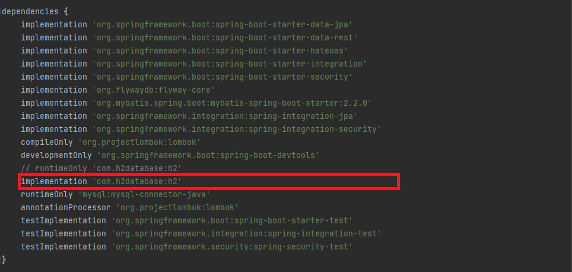
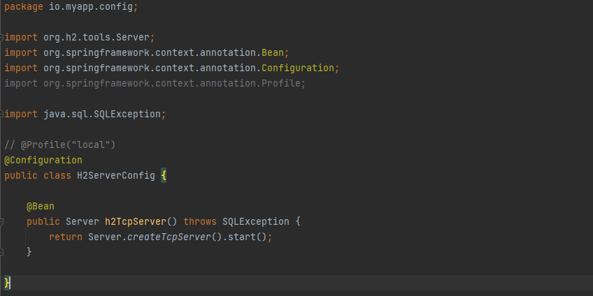
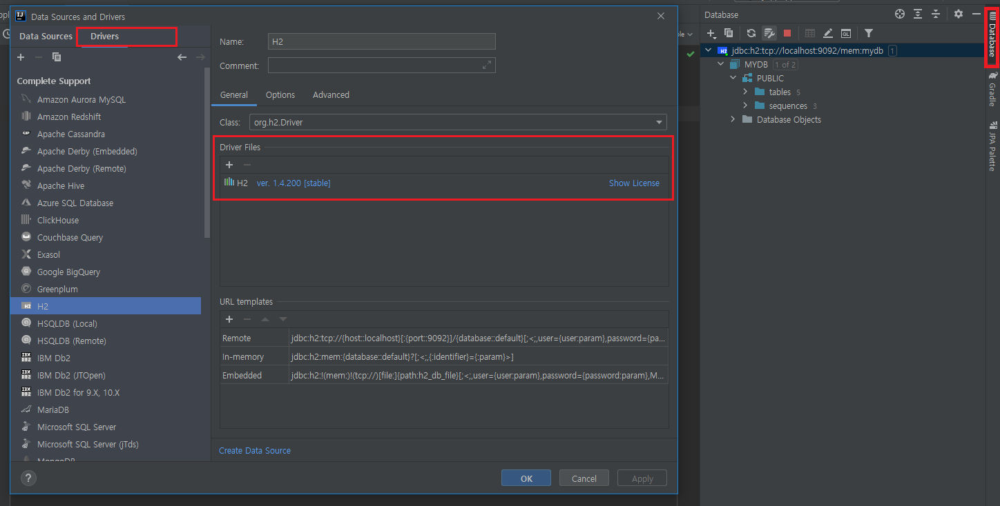
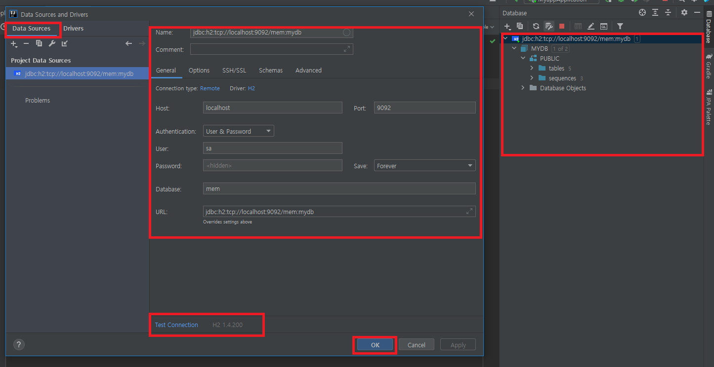
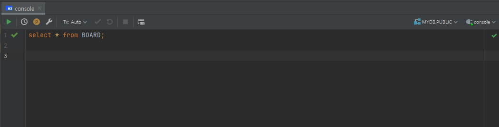

IntelliJ + H2 Database
=====

- **환경**

   - IntelliJ IDEA 2021.1.3 (Ultimate Edition)
   - H2 1.4

- **Step 1**

1. 의존 관계 설정 변경
1. H2 라이브러리를 소스 코드 수준에서 사용해야 하므로 `build.gradle`에서 H2를 다음과 같이 `compile`로 변경

- **Step 2**

1. H2 TCP 서버 구동 빈 추가
1. 스프링부트 애플리케이션을 실행하면 H2 TCP 서버가 함께 구동되고, 스프링부트 애플리케이션이 종료될 때 H2 TCP 서버도 함께 종료
1. 보통 H2는 개발용으로 로컬에서 사용하므로 빈 설정 시 다음과 같이 프로파일을 지정

- **Step 3**

1. IntelliJ 데이터베이스 탭 선택
1. 드라이버 설정

- **Step 4**

1. 데이터 소스 설정
1. 연결 테스트 진행
1. 저장 후 데이터베이스 정보 확인

- **Step 5**

1. 콘솔 오픈
1. 쿼리 작성 후 실행

