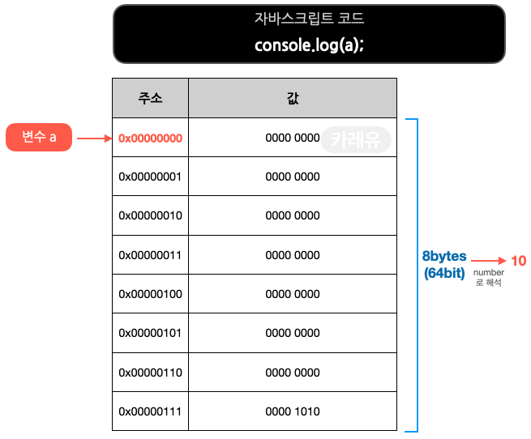

Function
=====

## Array

#### `push(v)`

- 배열의 끝에 아이템을 추가한다

```
var fruits = ["Apple", "Banana", "Orange", "Strawberry"];
var push = fruits.push("Grape");
console.log(push);
console.log(fruits);
```

- 출력 결과

```
5
["Apple", "Banana", "Orange", "Strawberry", "Grape"]
```

#### `pop()`

- 배열의 마지막 아이템을 제거한다

```
var fruits = ["Apple", "Banana", "Orange", "Strawberry"];
var pop = fruits.pop();
console.log(pop);
console.log(fruits);
```

- 출력 결과

```
Strawberry
["Apple", "Banana", "Orange"]
```

#### `shift()`

- 배열의 첫 번째 아이템을 제거한다

```
var fruits = ["Apple", "Banana", "Orange", "Strawberry"];
var shift = fruits.shift();
console.log(shift);
console.log(fruits);
```

- 출력 결과

```
Apple
["Banana", "Orange", "Strawberry"]
```

#### `unshift(v)`

- 배열의 앞에 아이템을 추가한다

```
var fruits = ["Apple", "Banana", "Orange", "Strawberry"];
var unshift = fruits.unshift("Grape");
console.log(unshift);
console.log(fruits);
```

- 출력 결과

```
5
["Grape", "Apple", "Banana", "Orange", "Strawberry"]
```

#### `splice()`

- splice(pos, length), pos 번째 부터 length 만틈 아이템을 제거한다

```
var fruits = ["Apple", "Banana", "Orange", "Strawberry"];
var splice = fruits.splice(1, 2);
console.log(splice);
console.log(fruits);
```

- 출력 결과

```
["Banana", "Orange"]
["Apple", "Strawberry"]
```

#### `slice()`

- 배열을 복제한다

```
var fruits = ["Apple", "Banana", "Orange", "Strawberry"];
var slice = fruits.slice();
console.log(slice);
console.log(fruits);
```

- 출력 결과

```
["Apple", "Banana", "Orange", "Strawberry"]
["Apple", "Banana", "Orange", "Strawberry"]
```

## Stack

#### `array.push(v)`, `array.pop()`

## Queue

#### `array.push(v)`, `array.shift()`

## Stream (ES6)

#### `map(currenValue, index, array)`
- 수집하기

#### `filter(value)`
- 거르기

#### `reduce(callback [, initivalValue])`
- 접기
- `callback(accumulator, currentValue, currentIndex, array)`


Local Variable Declarations
=====

- Declare all local variables with either `const` or `let`.
- Use `const` by default, unless a variable needs to be reassigned.
- The `var` keyword must not be used.

[**Google JavaScript Style Guide**](https://google.github.io/styleguide/jsguide.html)


Memory
=====

[**출처: https://curryyou.tistory.com/**](https://curryyou.tistory.com/)

#### 변수 선언 시
   

#### 변수 참조 시
   

#### 변수 재할당 및 가비지 컬렉터 (1/2)
   

#### 변수 재할당 및 가비지 컬렉터 (2/2)   
   
