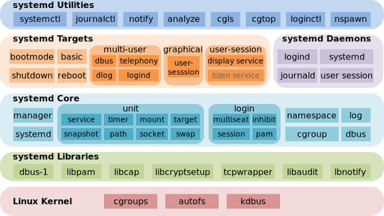

LINUX systemd
=====

   - 구조
      
      

   - "/etc/systemd/system" 디렉토리에 "tomcat.service" **서비스** 파일 생성

      ```
      $ cd /etc/systemd/system
      $ vi /etc/systemd/system/tomcat.service
      ```

   - **서비스** 내용을 입력 한 후 저장

      ```
      [Unit]
      Description=tomcat 9
      After=network.target syslog.target
      
      [Service]
      Type=forking
      Environment="JAVA_HOME=자바경로"
      Environment="CATALINA_HOME=톰캣경로"
      User=tomcat
      Group=tomcat
      ExecStart=톰캣경로/bin/startup.sh
      ExecStop=톰캣경로/bin/shutdown.sh
      
      [Install]
      WantedBy=multi-user.target
      ```

      - 주요 항목 설명
      
      | 항목 | 설명 |
      | ---: | :--- |
      | Environment | .bash_profile 설정은 bash shell 에 접속시 사용될 뿐, OS 구동 시 사용되는 systemd 에서는 **Enviroment**를 사용함.
      | WorkingDirectory | 프로세스의 작업 디렉토리를 지정함. 특정 디렉토리에서 실행해야하는 프로세스에서 필요함. 별도의 지정이 없으면 **"/"** 를 작업 디렉토리로 사용함.
      | After | 해당 라인에 등록되어 있는 서비스가 우선 실행되어야 현재 서비스가 실행됨. |
      | SuccessExitStatus | 성공으로 판단할 시그널을 설정함. |
      | multi-user.target | SysV **runlevel 3**와 동일한 의미임. |

   - **시스템** 시작 시 자동으로 시작 할 수 있도록 **서비스** 등록

      - 서비스 상태

      ```
      $ systemctl status tomcat.service
      ```

      - 서비스 비활성화

      ```
      $ systemctl disable tomcat.service
      ```

      - 서비스 활성화

      ```
      $ systemctl enable tomcat.service
      ```

      - 서비스 실행

      ```
      $ systemctl start tomcat.service
      ```

      - 서비스 종료

      ```
      $ systemctl stop tomcat.service
      ```

      - 서비스 내용 변경 시

      ```
      $ systemctl daemon-reload
      ```

      - 모든 서비스 조회

      ```
      $ systemctl list-units
      ```

      - 자세한 오류 및 기록 확인

      ```
      $ journalctl | grep tomcat.service
      ```
