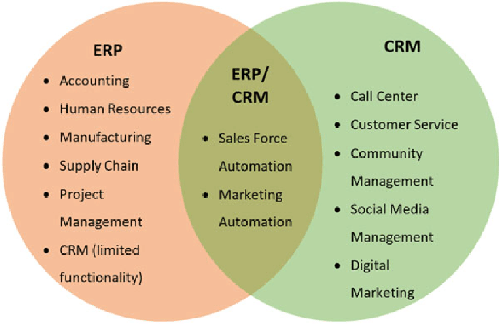
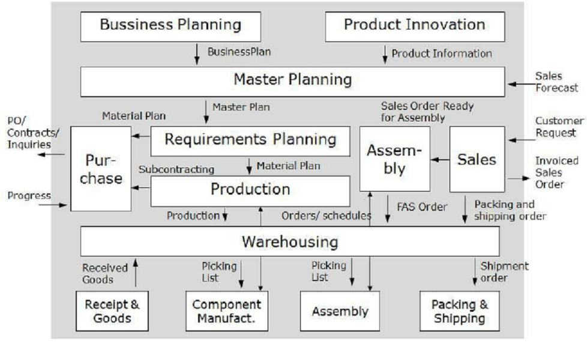
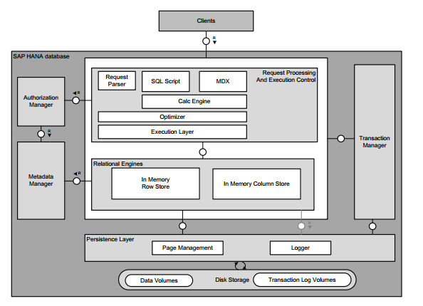

고객 관계 관리 솔루션
=====

 - SAP: Systems, Applications, and Products in Data Processing
 - CRM: Customer Relationship Management
 - ERP: Enterprise Resource Planning
 - SFA: Sales Force Automation
 
## CRM vs. ERP

- CRM 시스템의 주요 사용자는 영업과 지원 조직이다. 이들은 본질적으로 고객을 대면할 뿐, 주문 생성과 처리 실무는 하지 않는다.
- ERP 사용자는 공장 관리자, 생산 일정 관리자, 구매자, 공급망 관련자, 재무 관련자 등의 위젯 생산 절차와 실행 계획에 집중한다.
- ERP 사용자들은 내부자와 공급자를 대면하고, 모종의 불만에 대응할 때 이외에는 고객과 통화하는 경우가 거의 없다.

## CRM

## ERP

## SAP

