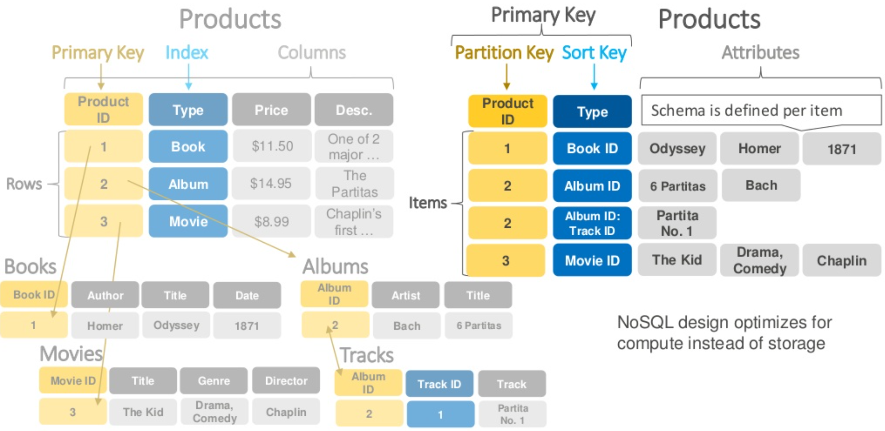
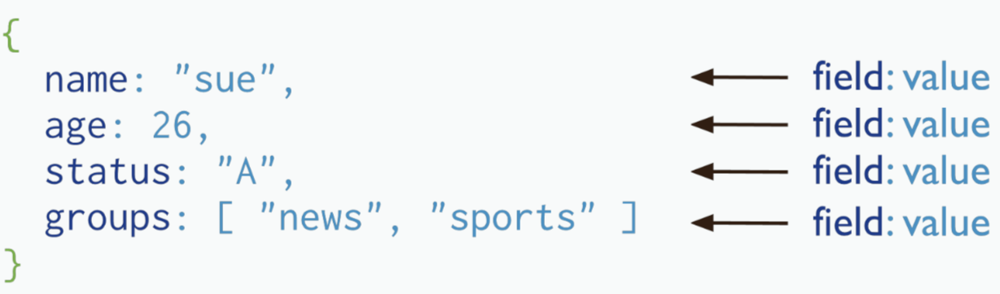
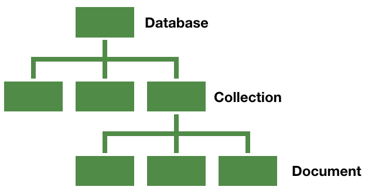

NoSQL
=====
 - NoSQL [Not Only SQL]
   - 스키마가 없다.
   - NoSQL은 가용성과 확장성이 높고, 고성능에 최적화된 비관계형 데이터베이스이다.
 - NoSQL 데이터베이스 타입
   - Key-value data stores
      - DynamoDB
      - Redis
      - Memcached
      - Hazelcast
      - Oracle NoSQL Database
      - Voldmorte
      - Oracle Berkeley DB
   - Document stores
      - DynamoDB
      - MongoDB
      - Azure Cosmos DB
      - CouchDB
      - MarkLogic
      - OrientDB
   - Wide-column stores
      - Cassandra
      - HBase
      - Google BigTable
      - Vertica
      - Druid
      - Accumulo
      - HyperTable
   - Graph stores
      - Neo4j
      - Blazegraph
      - OrientDB
      - AgensGraph (국내솔루션)
 - NoSQL 데이터베이스 장점
   - Scalability
   - Performance
   - High Availability
   - Global Availability
   - Flexible Data Modeling
   
`Redis`
-----

 - Redis는 키-값 형식으로 데이터를 저장하는 NoSQL 데이터베이스이다.
 - Redis는 BSD에서 제공하는 오픈 소스 데이터베이스이다.
 - Redis 는 원격 사전 서버를 의미한다. 키에는 키와 값이 문자열인 문자열 해시, 정렬된 문자열 집합, 저장된 집합 및 문자열 목록과 같은 많은 데이터 유형이 포함되어 있으므로 데이터 구조 서버라고도 한다.
 - Redis에서 원자 연산을 수행 할 수 있다. Redis는 전체 데이터 세트를 메모리에 저장하므로 데이터를 디스크에 덤프하여 유지할 수 있다.
 - Redis는 2 초마다 데이터를 디스크에 동기화하기 때문에 시스템이 실패하면 몇 초 동안만 데이터가 손실된다. 이를 유지하는 또 다른 방법은 각 명령을 로그에 추가하는 것이다. Redis는 마스터-슬레이브를 지원한다.

`Amazon DynamoDB`
-----
 - Key-value data stores for NoSQL
 - Document stores for NoSQL
 - 특정
   - Amazon DynamoDB는 확장성이 뛰어난 문서 데이터베이스이다.
   - 2012 년 Amazon에서 제공했다. 문서 저장소 및 키-값 저장소로 기본 데이터베이스 모델이 있다.
   - 상업용 라이선스가 있다. 트랜잭션을 사용하고 ACID 속성을 따른다. 백업 시설이 있고 보안성이 높다.
   - Amazon DynamoDB는 내구성 있고 강력한 데이터베이스이다.
   - 하루에 엄청난 수의 요청을 처리 할 수 있으며 서버리스로 관리할 수 있다.
 - 테이블
   - 스키마가 없음. 데이터 형식을 미리 정의할 필요가 없음.
   - 테이블 크기 제한 없음.
 - 항목
   - 최대 항목 크기가 400 KB를 초과할 수 없음. 속성 이름은 크기 제한에 포함함.
 - 장점
   - 클러스터링, 백업정책, 성능향상, 다중리젼 지원함.
   - AWS에서 운영하는 serverless 플랫폼의 DB이며, AWS support로 운영시 장애 해결 가능함.
 - 단점
   - ORM 지원 라이브러리가 없음.
   - 분량이 큰 REST API 서비스를 만들기 위해서 nosql 쿼리 코드 관리 전략이 필수 요소임.
   - 대부분의 nosql들이 가지고 있는 단점으로 여러 쿼리에 대해 일관성, 원자성을 보장하지 않음. No Transaction 극복 전략이 필요함.
   - 러닝커브 큼, 기존에 알고있던 RDBMS와 MongoDB의 혼종으로만 생각하면 안됨.

 - RDBMS와 DynamoDB 비교

   

`MongoDB`
-----
 - Document stores for NoSQL
 - MongoDB는 C++로 작성된 오픈소스 문서 지향적(Document-Oriented)임. Cross-platform 데이터베이스이며 뛰어난 확장성과 성능을 자랑함.
 - mongo Shell: https://docs.mongodb.com/manual/reference/method/

 - RDBMS와 MongoDB 비교
 
| RDBMS | MongoDB |
| ---: | :--- |
| Table, View | Collection |
| Row, Record | Document |
| Column | Field |
| Index | Index |
| Join | Embedded Document |
| Foreign key | Reference |
| Partition | Shard |

 - Document 예시

   

 - 구조

   
