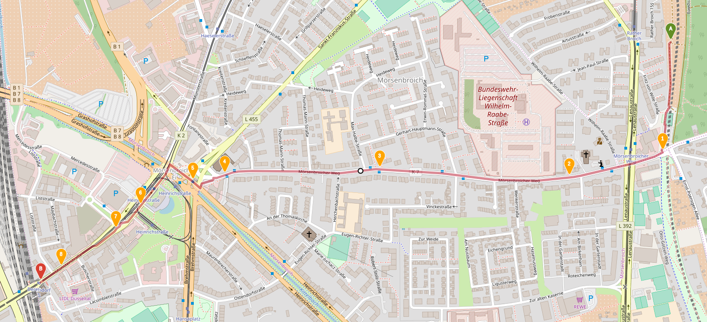
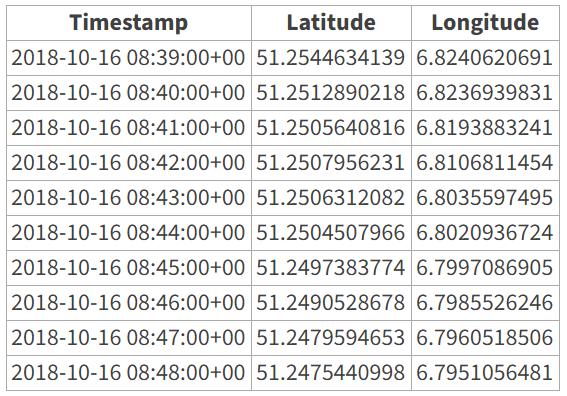

Time Series DB
=====
 - 데이터 특성 (정형/비정형)
   - 시간 흐름에 따라 발생하는 로그, 이벤트 정보

 - 데이터 입력 위주
   - 데이터 업데이트 없고 과거 데이터순 삭제

 - ID, 상태 정보 포함
   - 해당 데이터 소소의 ID 및 상태 정보를 반드시 포함

 - 시간 데이터
   - 시간을 기준으로 각종 통계, 분석 수행

 - 종류

   

 - 시각화

   

 - 데이터

   
