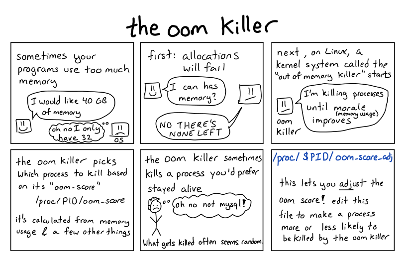

The Linux Out-of-Memory Killer
=====


* 개념




* `OOM Killer`에 의한 프로세스 종료 로그 확인

```
$ grep -i kill /var/log/messages*

host kernel: Out of Memory: Killed process 2592 (oracle).
```


* `메인 메모리` 현황
* `High / Low 메모리` 현황
* `Swap 메모리` 현황

```
$ free -lm
             total       used       free     shared    buffers     cached
Mem:           498         93        405          0         15         32
Low:           498         93        405
High:            0          0          0
-/+ buffers/cache:         44        453
Swap:         1023          0       1023
```

```
$ egrep 'High|Low' /proc/meminfo

HighTotal:             0 kB
HighFree:              0 kB
LowTotal:         510444 kB
LowFree:          414768 kB
```
