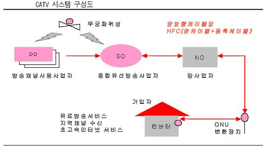

미디어사업자 용어정리
=====

 - `PP`: Programme Provider
 - `MPP`: Multiple Programme Provider
 - `SO`: System Operator
 - `MSO`: Multiple System Operator
 - `MSP`: Multiple SO PP
 - `NO`: Network Operator

## CATV 시스템 구성도

## PP (Programme Provider)

- 채널사용사업자. TV프로그램을 제작, 공급하는 사업자
- 예) YTN, MBN, OCN, 온스타일, 온게임넷, 캐치온, TVN, MNET, 올리브, 바둑TV 등

## MPP (Multiple Programme Provider)

- 복수채널사용사업자. 복수의 채널을 소유하여 운영하는 사업자
- 예) CJ 미디어, 온미디어 등

## SO (System Operator)

- 종합유선방송국

## [MSO](https://ko.wikipedia.org/wiki/종합유선방송사업자) (Multiple System Operator)

- 복수의 종합유선방송국(케이블TV방송국, SO)을 소유한 사업자
- 예) 딜라이브, SK브로드밴드, LG헬로비전, CMB, 현대HCN 등

## MSP (Multiple SO PP)

- 복합케이블TV방송사업자
- 케이블TV방송국(SO)과 프로그램공급사(PP)를 겸영하는 형태

## NO (Network Operator)

- 전송망 사업자
- 종합유선방송국(SO) 지역에 망을 구축하여 케이블TV 가입자가 시청할 수 있도록 전송망 제공
