데이터플랫폼
=====

 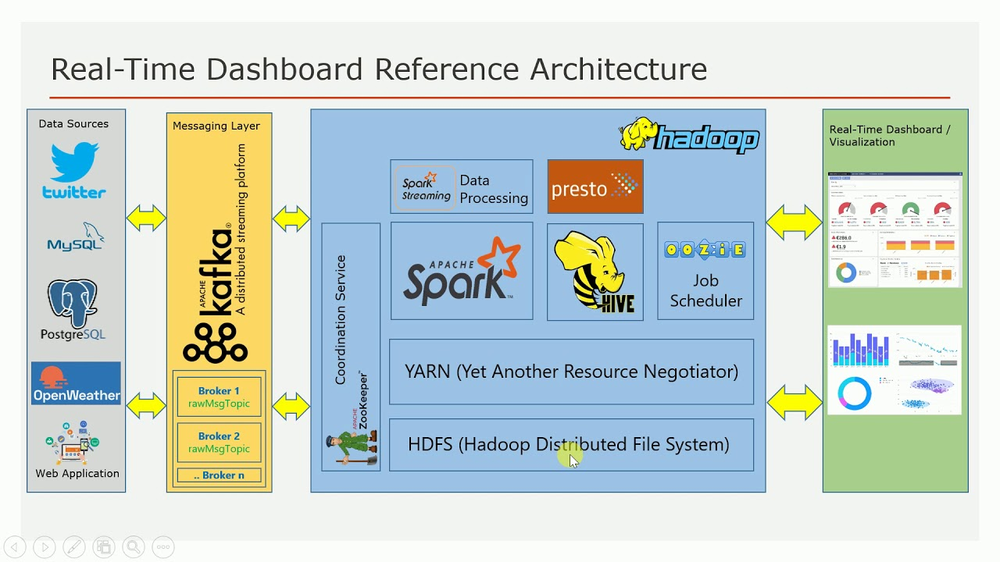

HDFS 네임노드 힙메모리 관리
=====

- **메모리 용량 산정**
```
블록 사이즈: 128MB, 복제개수 1
------------------------------------------------------------
 ㅇ 호스트 200개, 블록: 128MB, 복제개수: 1
 ㅇ 호스트당 24TB
    - 200 * 24 TB = 4800 TB
 ㅇ 복제개수 1 이므로 블록당 128MB 필요함
 ㅇ 4800TB / 128MB = 36,000,000
    - 백만(1,000,000)블록당 1G
    - 36G의 힙사이즈가 필요함
```

Hive View
=====

 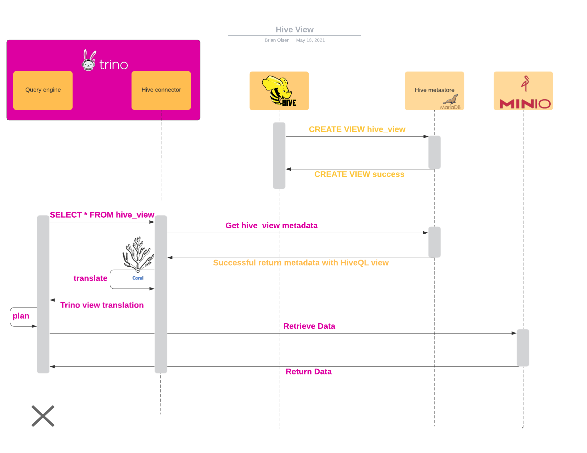

Hive Materialized View
=====

 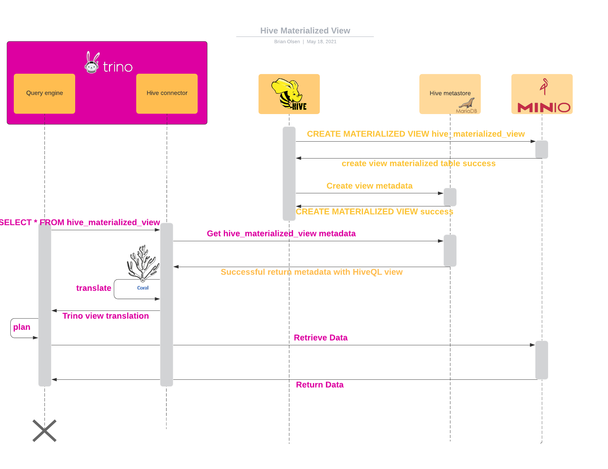

Trino View
=====

 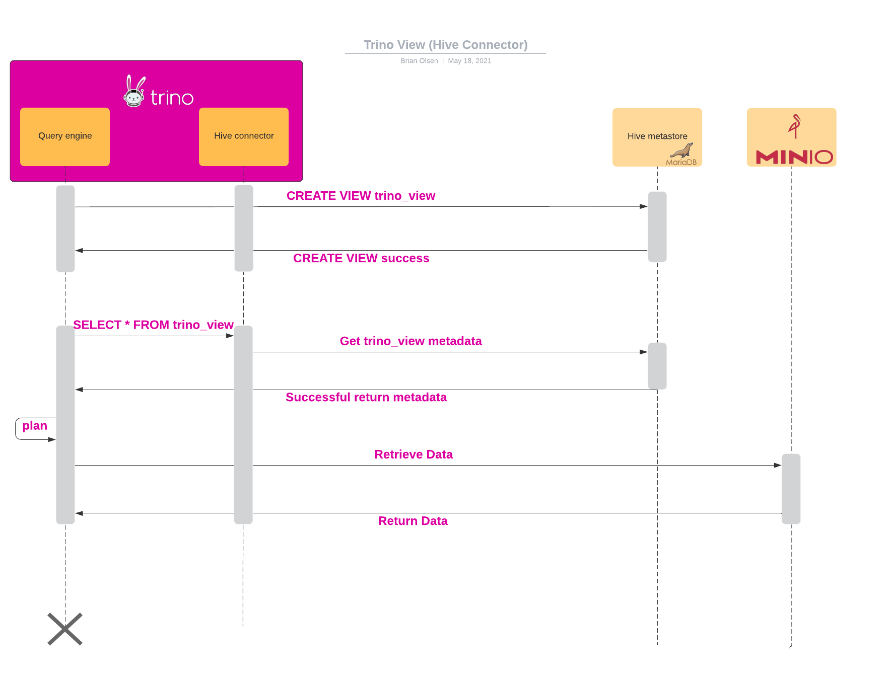

Trino Materialized View
=====

 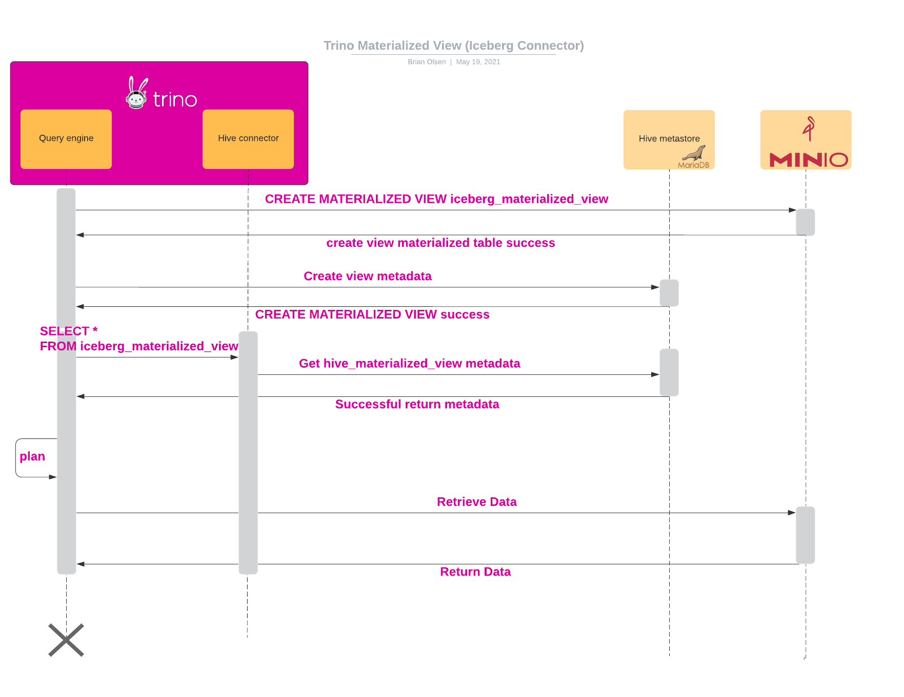

- **외부 테이블**
   1. 외부 테이블(External Table)은 이미 하둡에 데이터가 있는 데이터를 기반으로 테이블을 만들기 때문에 스키마만 정해주면 됩니다. 그래서 파일 따로, 스키마 따로 관리하기 좋습니다. 그럴 일이 있어서는 안되겠지만 누군가 테이블을 날려버려도 데이터는 안전합니다!
   1. 데이터 포맷 - csv, parquet, json

- **관리형 테이블**
   1. 관리형 테이블(Internal Table)을 생성하면 파일이 기본 저장 경로인 /user/hive/warehouse에 저장됩니다. 외부 테이블과 다르게 drop 하면 데이터와 스키마가 함께 삭제되기 때문에 주의해야합니다.
   1. 파티션, 클러스터

Trino Architecture
=====

 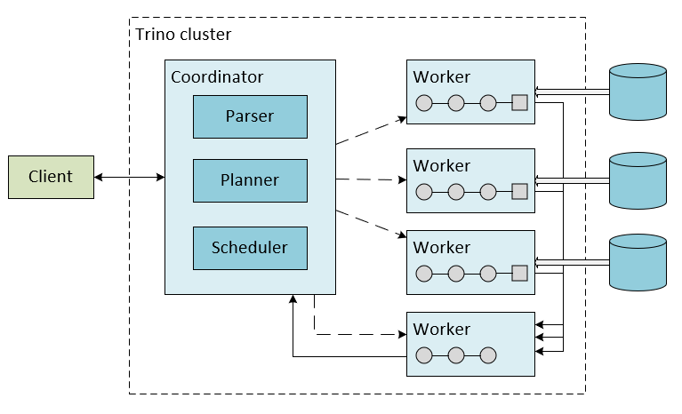

YARN 클러스터 모드
=====

 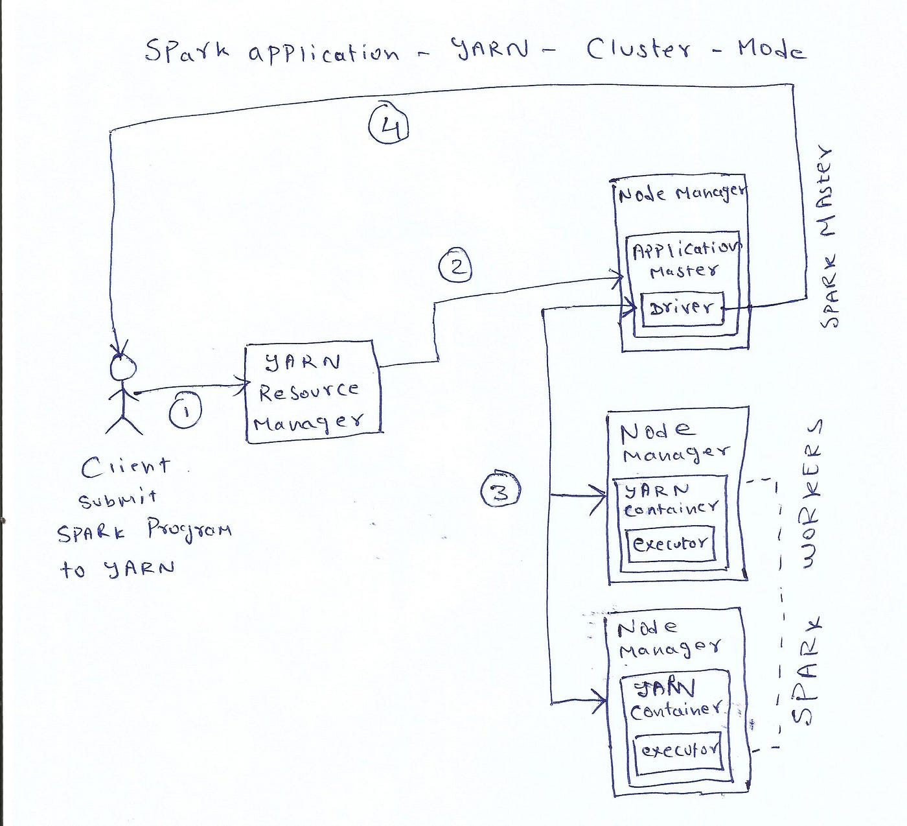

YARN 위에서 Application 을 실행하는 단계
=====

## 1. Application submitted to Resource Manager
 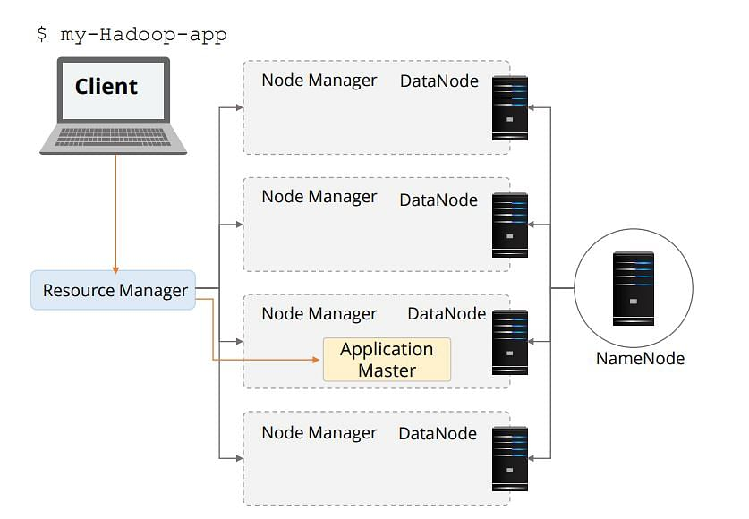

## 2. Application Master requests to Resource Manager
 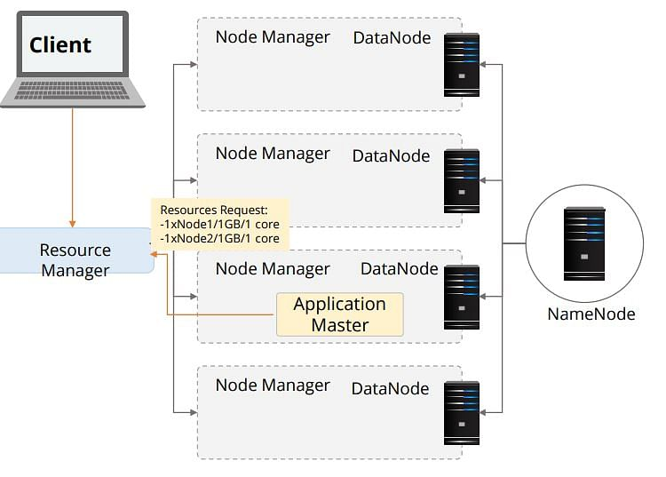

## 3. Resource Manager allocates container
 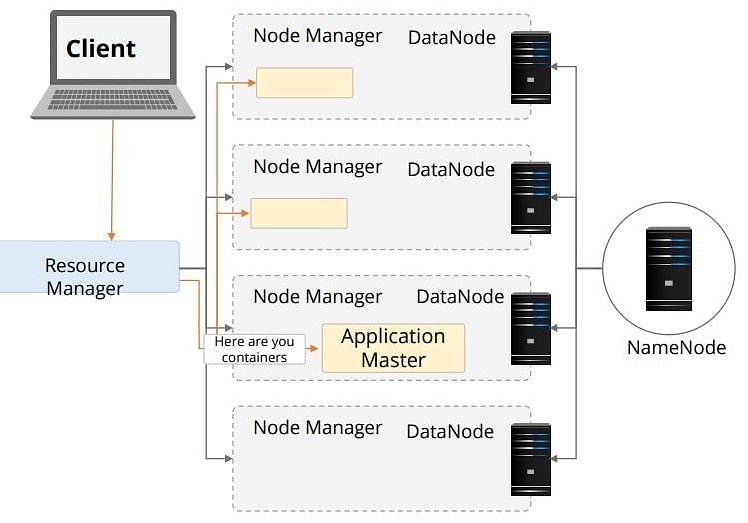

## 4. Application Master contacts Node Manager
 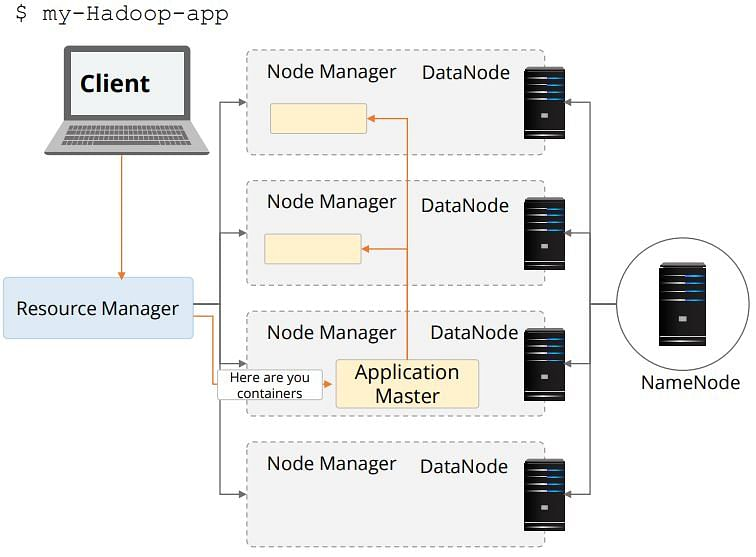

## 5. Container executes the Application Master
 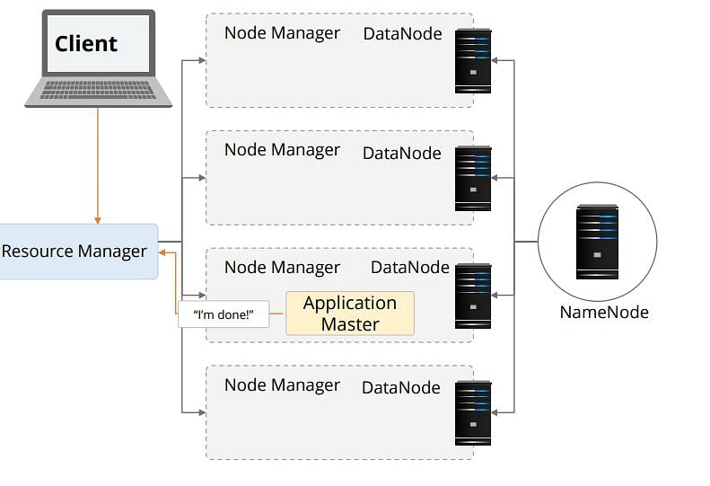
