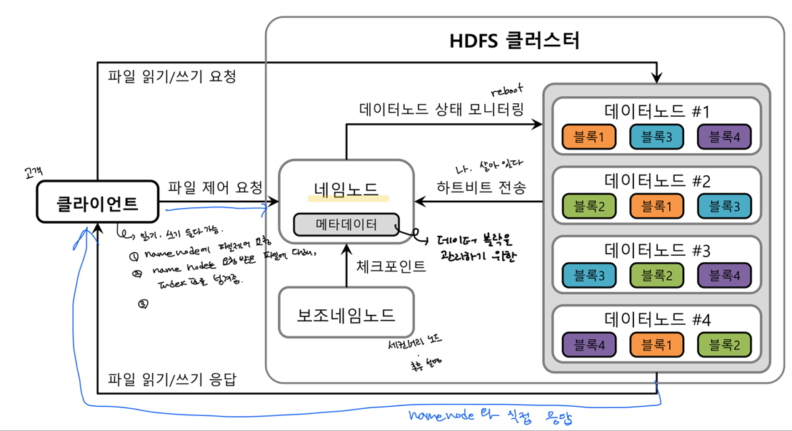

데이터플랫폼
=====

 

HDFS 구조
=====

## 1. HDFS Cluster
 

## 2. HDFS Architecture
 

HDFS 네임노드 힙메모리 관리
=====

### 네임노드 힙메모리 용량 산정 방법

```
[블록 사이즈: 128MB, 복제개수 1]
 ㅇ 호스트 200개, 블록: 128MB, 복제개수: 1
 ㅇ 호스트당 24TB
    - 200 * 24 TB = 4800 TB
 ㅇ 복제개수 1 이므로 블록당 128MB 필요함
 ㅇ 4800TB / 128MB = 36,000,000
    - 백만(1,000,000)블록당 1G
    - 36G의 힙사이즈가 필요함
```

| 디스크(MB)	| 블록(MB)	| 복제갯수	| 블록갯수	| 네임노드힙메모리(GB) |
|---:|---:|---:|---:|---:|
| A	| B	| C	| A/(B*C)	| D/1,000,000 |
| 4,800,000,000 | 128 | 1 | 37,500,000 | 37.50 | 
| 50,000,000 | 128 | 3 | 130,208 | 0.13 | 

### 디스크 사이즈

```
데이터 노드는 디스크를 많이 사용할 것이라고 생각해서 많은 디스크를 설정합니다. 하지만 노드 매니저의 디스크도 애플리케이션에 따라 많은 용량을 사용하기 때문에 적절한 용량을 설정해야 합니다.

스파크 스트리밍 작업에서 발생하는 로그 정보도 일정기간 쌓이게 되면 무시할 수 없는 수준입니다. 사용자가 로그에 어떤 정보를 출력한다고 하면 더욱 많은 용량이 쌓이게 됩니다.

맵리듀스나 스파크 작업에서 셔플 단계에서 발생하는 데이터도 상당합니다. 셔플을 위한 데이터가 메모리 용량을 넘어서 임시로 디스크에 쌓이게 되면 디스크 부족을 유발 할 수 있기 때문에 적절한 용량을 설정해야 합니다.

운영하면서 각 상황에서 단일 애플리케이션의 로그만 60G, 단일 작업의 셔플 데이터만 50G가 쌓인 경우가 있었습니다. 애플리케이션 설계에서 이런 부분을 고려하면 좋겠지만 모든 상황에서 그렇데 될 수 없기 때문에 노드매니저의 디스크도 적당한 크기로 선택해야 합니다. 
```

### 메모리 사이즈

```
데이터노드, 노드매니저가 기본적으로 사용하는 메모리 사이즈도 잘 생각해야 합니다. 처음에는 메모리 사용량이 많지 않지만 운영 일자가 길어지고, 데이터가 많아 질 수록 메모리 사용량도 점점 증가하게 됩니다.
노드매니저에 할 당할 수 있는 기본메모리를 설정 할 때 데이터 노드와 같은 노드에 동작하고 있다면 데이터 노드와 노드 매니저 OS 가 기본적으로 사용하는 메모리를 생각하고 메모리를 할당 해야 합니다.

ㅇ 데이터노드: 15~20G
ㅇ 노드매니저: 10~15G
ㅇ OS: 메모리 4G
```

Hive View
=====

 

Hive Materialized View
=====

 

Trino View
=====

 

Trino Materialized View
=====

 

- **외부 테이블**
   1. 외부 테이블(External Table)은 이미 하둡에 데이터가 있는 데이터를 기반으로 테이블을 만들기 때문에 스키마만 정해주면 됩니다. 그래서 파일 따로, 스키마 따로 관리하기 좋습니다. 그럴 일이 있어서는 안되겠지만 누군가 테이블을 날려버려도 데이터는 안전합니다!
   1. 데이터 포맷 - csv, parquet, json

- **관리형 테이블**
   1. 관리형 테이블(Internal Table)을 생성하면 파일이 기본 저장 경로인 /user/hive/warehouse에 저장됩니다. 외부 테이블과 다르게 drop 하면 데이터와 스키마가 함께 삭제되기 때문에 주의해야합니다.
   1. 파티션, 클러스터

Trino Architecture
=====

 

YARN 클러스터 모드
=====

 

YARN 위에서 Application 을 실행하는 단계
=====

## 1. Application submitted to Resource Manager
 

## 2. Application Master requests to Resource Manager
 

## 3. Resource Manager allocates container
 

## 4. Application Master contacts Node Manager
 

## 5. Container executes the Application Master
 
