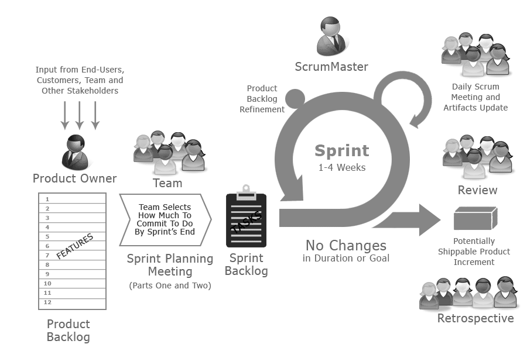
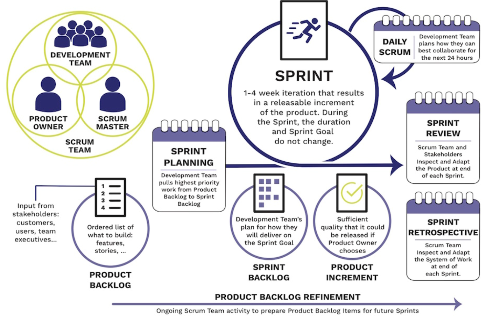
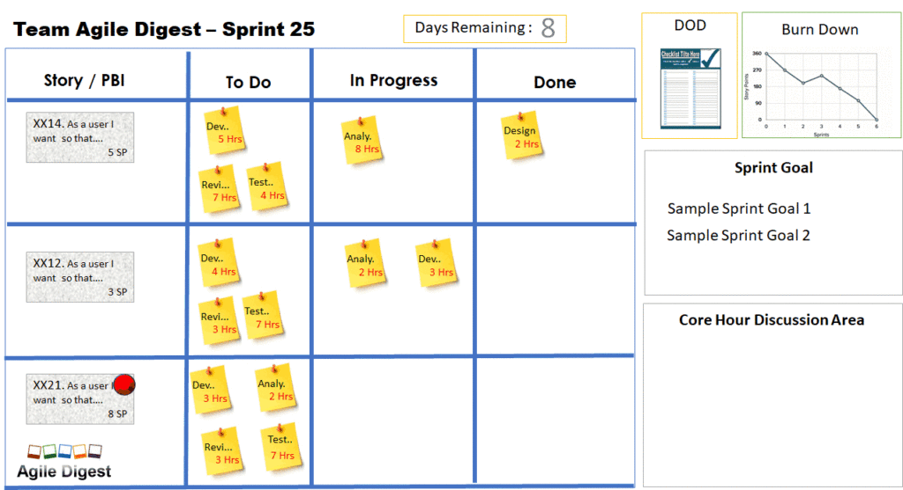
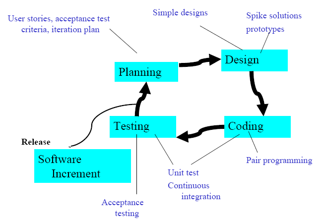
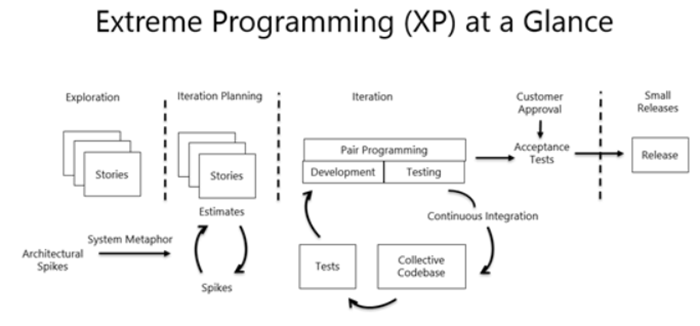
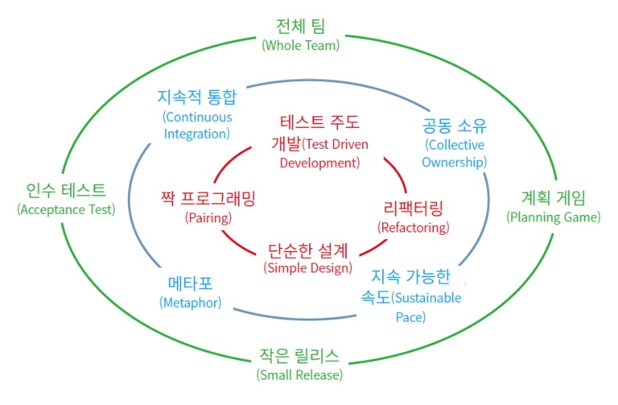

개념
=====
- **애자일**(Agile)은 **'기민하다'**라는 뜻으로 너무 계획이 없는 개발 방법론과 너무 체계적인 계획이 있는 개발 방법론 사이의 균형을 잡아보자는 의도로 나온 개발 방법론이다.
- 계획을 따르기보다 **변화**에 대응하는데 가치를 두고, 수직적인 업무 진행이 아닌 **수평적** 커뮤니케이션과 공개/공유(결과뿐만 아니라 그 맥락까지)을 중시한다.

종류
=====
1. Scrum
1. Kanban board
1. XP (Extreme Programming)

Scrum
=====



Kanban Board
=====


Extreme Programming
=====




```
+---------------------------+-------------------------------+-------------------------------------------------------------------------------------+
| Fine scale feedback       | Pair Programming              | 개발 머신 당 두 명의 개발자. 상호 보완 체계 구현
|                           | Planning game                 | 개발 계획을 위한 실천 방법. 릴리스/iteration 계획으로 나뉨
|                           | TDD                           | 구현 전 단위 test driver의 작성을 통한 validation
|                           | Whole Team                    | 고객 역시 개발 팀의 일원
+---------------------------+-------------------------------+-------------------------------------------------------------------------------------+
| Continuous Process        | Continuous Integration        | 개발은 누구에게나 최신 버전에서 수행되도록(이후 통합으로 인해 지연을 야기하지 않도록).
|                           | Refactoring                   | (성능 및 유지보수성 모두에서) 최적화된 코드의 유지
|                           | Small Release                 | 작고도 자주 수행되는 릴리스를 통한 신뢰도 향상
+---------------------------+-------------------------------+-------------------------------------------------------------------------------------+
| Shared understanding      | Coding Standards              | 팀원 모두에게 적용되는 일관된 코딩 규칙을 통한 코드 품질 제고
|                           | Collective code ownership     | 모든 코드는 개발 팀원 모두의 책임임.
|                           | Simple design                 | Refactoring과 함께 언제나 단순성을 최대한 유지하도록
|                           | System metaphor               | 구현 대상 시스템의 동작 방법을 개발자-고객 모두가 알 수 있는 언어로 표현하도록(코드에서도)
+---------------------------+-------------------------------+-------------------------------------------------------------------------------------+
| Programmer welfare        | Sustainable pace              | 40시간 이상의 초과 작업은 금물. 이는 전체 생산성을 떨어뜨림.  
+---------------------------+-------------------------------+-------------------------------------------------------------------------------------+ 
```
