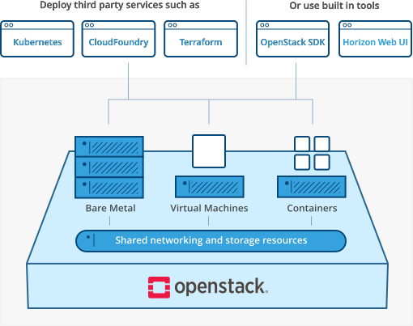
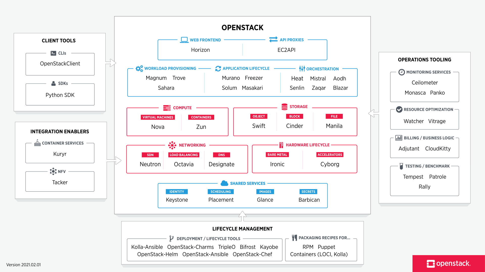
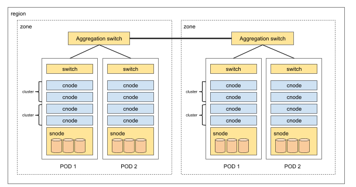

오픈스택이란?
=====

오픈스택 컴포넌트
=====

[출처] - [**openstack.org**](https://www.openstack.org/)

클라우드 인프라 아키텍쳐
=====

| 컴포넌트 | 구분 | 설명 |
|:---|:---|:---|
| **region** | region | 물리적인 지역 |
| **zone** | region-zone | 데이터 센터 |
| **pod** | region-zone-pod | rack |
| **cluster** | region-zone-pod-cluster | storage를 공유하는 단위 |

| 컴포넌트 | 구분 | 설명 |
|:---|:---|:---|
| **pod** | cnode - computing node | cpu와 메모리 제공 |
| **pod** | snode - storage node | 볼륨 제공 |
| **pod** | TOR | POD를 관리하기 위한 소프트웨어가 설치 |

[출처] - [**https://www.joinc.co.kr**](https://www.joinc.co.kr/w/Site/cloud/InfraStructure)
