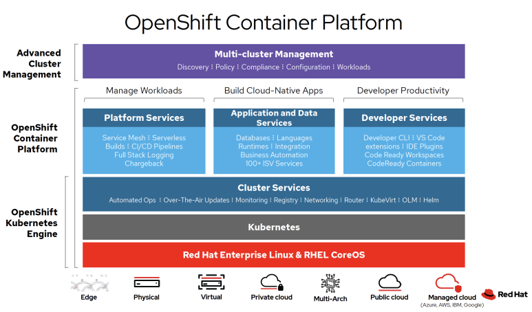
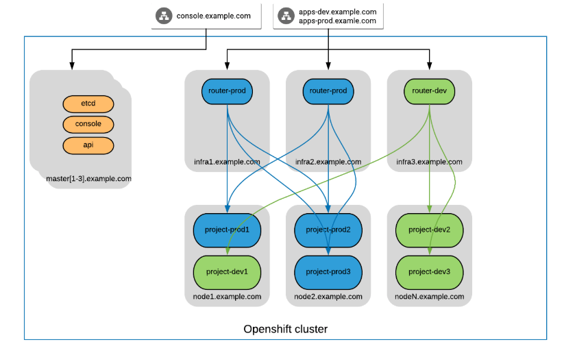

오픈시프트란?
=====

오픈시프트(OpenShift)는 컨테이너 기반 소프트웨어의 디플로이 및 관리를 위한 레드햇의 컴퓨터 소프트웨어 제품이다. 구체적으로 말해, 가속화된 애플리케이션 개발을 위해 도커 컨테이너와 데브옵스 도구를 사용하는 쿠버네티스의 지원 배포판이라 할 수 있다.

Cluster and Router Architecture
=====

