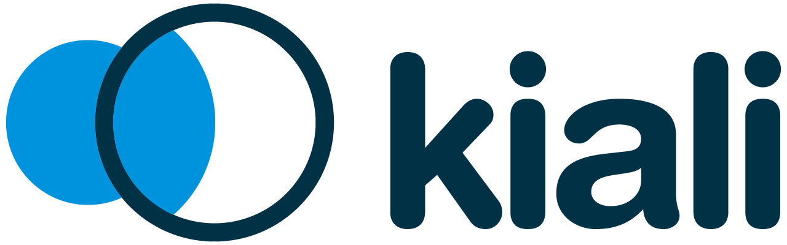
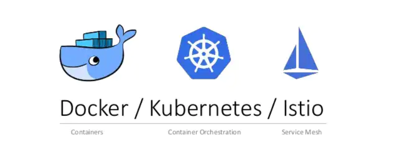
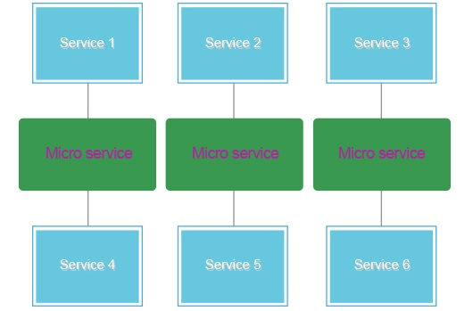
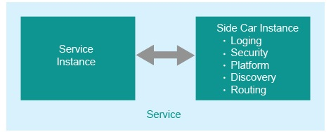
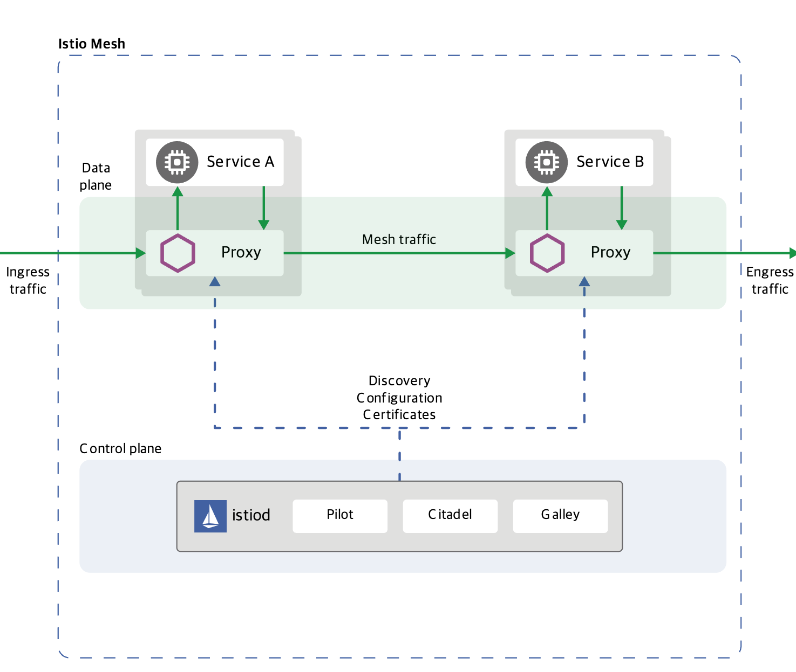
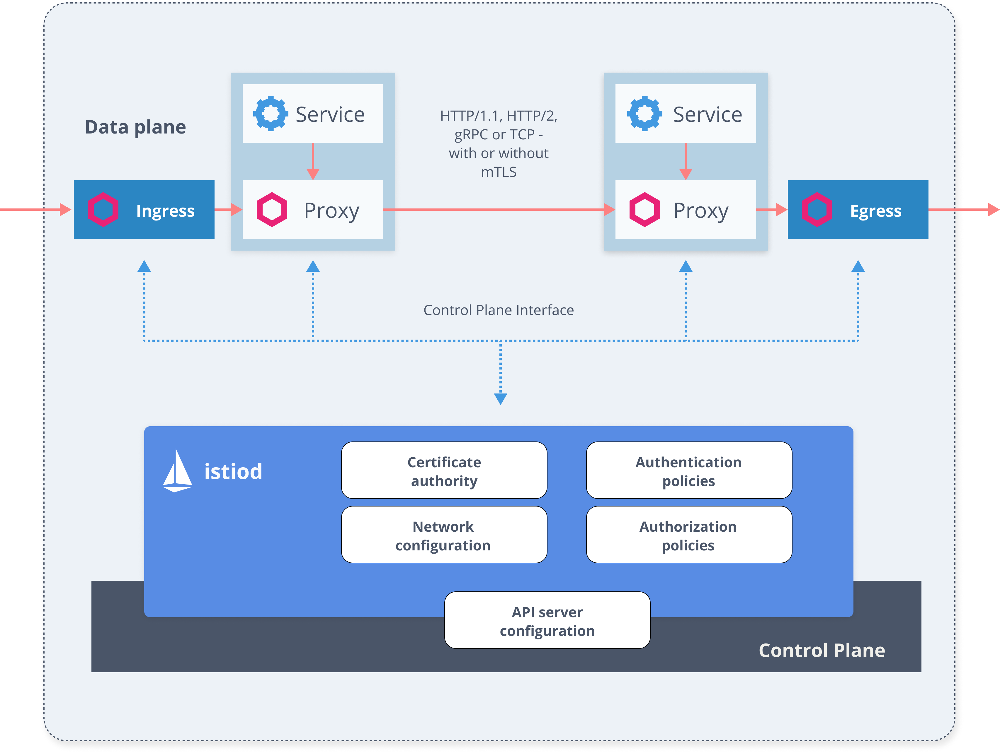

서비스 메쉬와 넷플릭스 OSS
=====

# **마이크로서비스**

- [**넷플릭스 OSS**](./마이크로서비스.md)

# 서비스 매쉬

### 구조

### 구성 요소

 - 
 - 
 - 
 - 

1. **컨테이너 기반**
   
   - 현재 쿠버네티스와 컨테이너는 마이크로서비스 애플리케이션을 실행하는데 사실상 표준이 됨
   
   

1. **서비스 메쉬**

   - 마이크로 서비스
   
   

   - 서비스 메쉬의 핵심, 사이드카 (Sidecar) 패턴
   
   
   
   - [**Istio (이스티오)**](https://istio.io/)
      - 마이크로서비스 기반 앱을 어디서나 실행할 수 있도록 지원하는 오픈소스 서비스 메쉬
      - Istio는 파일럿과 사이드카 프록시인 Envoy를 통해 트래픽을 제어하고 관리
      
      
      
         * Pilot: 서비스 디스커버리
         * Citadel: 보안 인증/인가
         * Gallery: Config 매니지먼트
      
      - 보안 구성
      
      
  
   - [**Envoy (엔보이)**](https://www.envoyproxy.io/)
      - Envoy는 L7 프록시 (OSI 7 Layer)로 커뮤니케이션 버스 역할

1. **트레이싱**
   
   - [**Jaeger (예거)**](https://www.jaegertracing.io/)
      - 분산 추적 (Distributed tracing)
   
   - [**Kiali (키알리)**](https://kiali.io/)
      - Visualizing mesh
      - Istio에서 수집한 지표 기반으로 서비스간의 관계와 처리량, 정상 여부, 응답시간 등을 시각화
