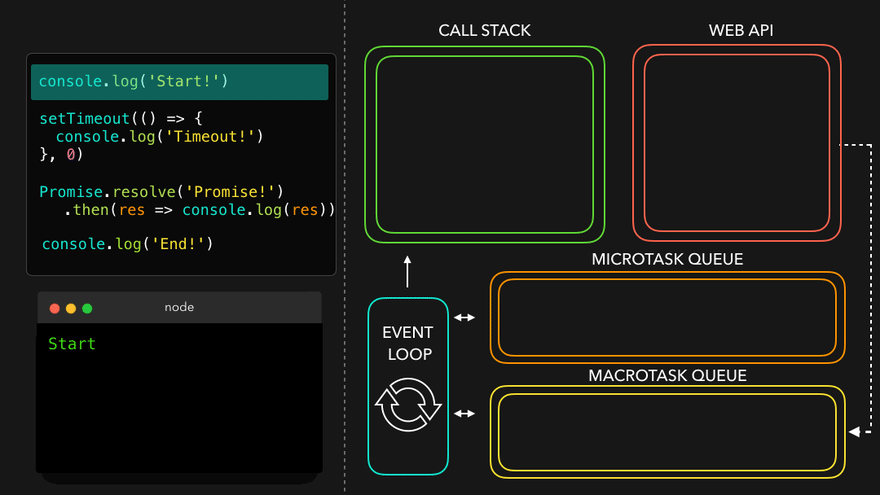

자바스크립트 비동기 처리 시각화
=====

### 비동기 시각화 #1

- 엔진은 `console.log`를 만납니다. 이 메소드는 콜스택에 추가되고, `Start!`를 기록한 후에 콜스택을 빠져나간 후 엔진은 계속 진행합니다.

- 엔진이 `setTimeout`을 만나고, 이 메소드는 콜스택에 추가됩니다. 타이머가 완료 될 때까지, 콜백 함수 `() => console.log('In timeout')`는 Web API에 추가됩니다.

- 엔진은 `Promise.resolve()`를 만납니다. `Promise.resolve()`는 콜스택에 추가되고, 그 후에 `Promise`의 값이 resolve됩니다. 이후 `then`의 콜백 함수가 **마이크로태스크 큐**에 추가됩니다.

- 엔진은 `console.log`를 만납니다. 이 메소드는 콜스택에 즉시 추가되고, `End!`를 기록한 후에 콜스택을 빠져나갑니다.

- 콜스택이 비어 있기 때문에, 엔진은 **마이크로태스크 큐**에 대기중인 작업이 있는지 확인합니다. 이 콜백은 콜스택에 추가되고, promise의 resolve된 값을 기록합니다. 이 경우에는 `Promise!`입니다.

- 엔진은 콜스택이 비었음을 확인하고, **마이크로태스크 큐**를 다시 한 번 확인합니다. **마이크로태스크 큐**는 전부 비었습니다.
- 이제 **매크로태스크 큐**를 확인합니다. `setTimeout`의 콜백이 대기하고 있습니다. `setTimeout`의 콜백은 콜스택에 추가됩니다. 이 콜백은 `console.log`를 반환 `In timeout!`를 기록합니다.

### 비동기 시각화 #2

- 먼저, 엔진이 `console.log`를 만납니다. 이 메소드는 콜스택에 추가되고, `Before function!`를 기록합니다.

- 이제 우리는 async 함수인 `myFunc()`를 호출합니다. 그 후 myFunc 함수의 본문이 실행 됩니다. 함수 본문의 첫 번째 라인에서 또 다른 `console.log`를 부릅니다. 이 때, 문자열은 `In function!`입니다.

- `await` 키워드를 만나게 되면, `async` 함수가 일시중지 됩니다.

- `await` 키워드를 만나 `myFunc` 함수가 일시정지 되었으니, 엔진은 async 함수에서 빠져나와 async 함수가 호출된 실행 컨텍스트에서 코드를 계속 실행합니다.

- 이벤트 루프는 마이크로태스크 큐에 남아있는 작업을 확인합니다! async `myFunc` 함수가 `one` 의 값을 resolve한 후 대기하고 있습니다! myFunc은 콜스택에 돌아오고, 이전에 중단됐던 위치에서 다시 실행됩니다.

