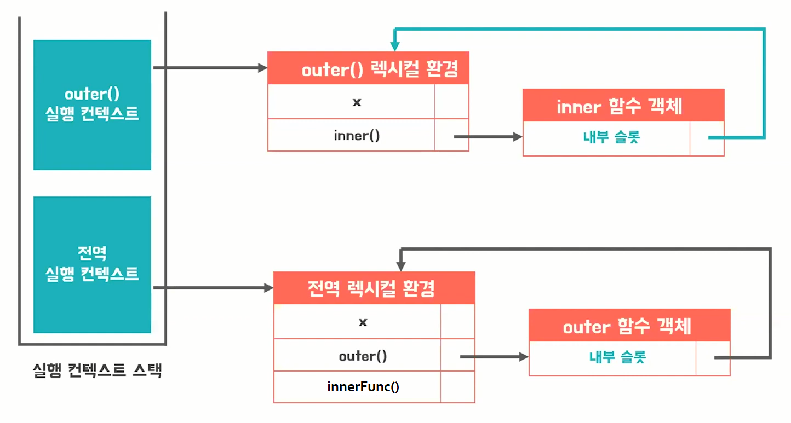
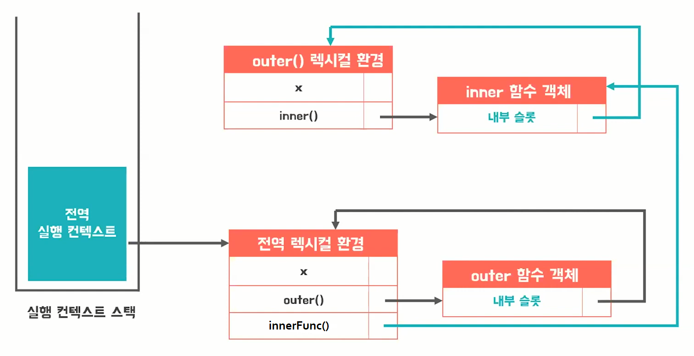

자바스크립트 클로저 (Closure)
=====

### 정의

- **closure**는 **외부 함수**의 **컨텍스트**에 접근하여 **자유 변수**에 접근할 수 있는 **내부 함수** 또는 그 환경
- **중첩 함수**
   - **상위 스코프**의 식별자를 참조하고 있고
   - 본인의 **외부 함수**보다 더 오래 살아있다면

### 코드

```
const x = 1;

function outer() {
	const x = 10;
	const inner = function() {
		console.log(x);
	};
	return inner;
}

var innerFunc = outer();
innerFunc(); // 10
```


### 실행 컨텍스트와 렉시컬 스코프




