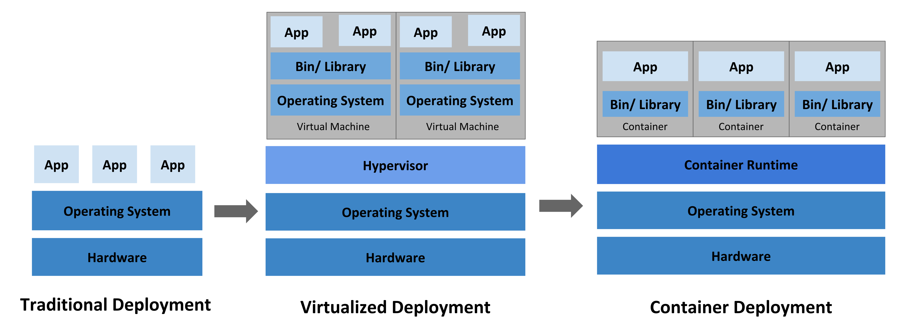
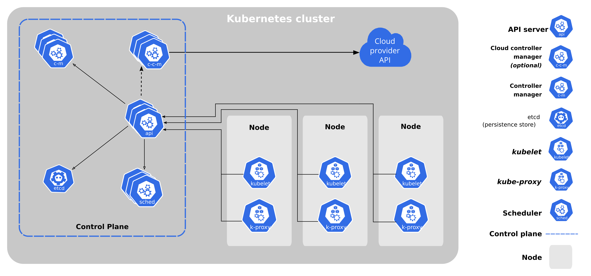
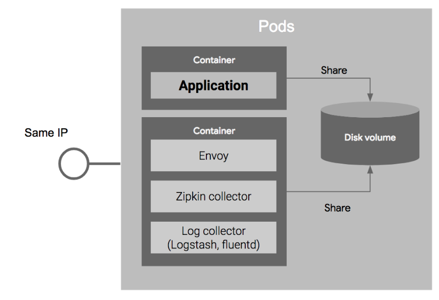
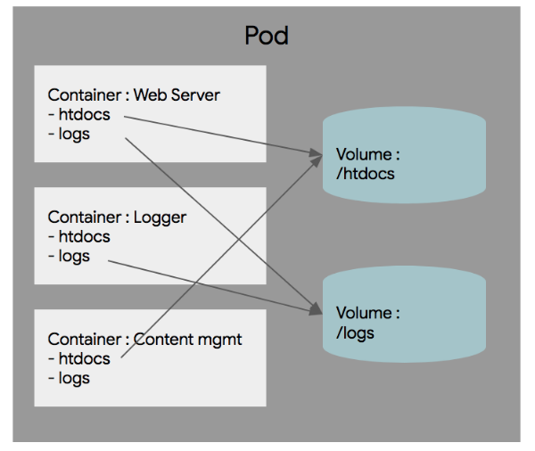

쿠버네티스
=====

K8s라고도 알려진 쿠버네티스는 컨테이너화된 애플리케이션을 자동으로 배포, 스케일링 및 관리해주는 오픈소스 시스템이다.

[**쿠버네티스 문서/홈**](https://kubernetes.io/ko/docs/home/)

개요
=====

시간이 지나면서 쿠버네티스가 왜 유용하게 되었는지 살펴보자.

쿠버네티스 컴포넌트
=====

컨트롤 플레인 컴포넌트, 노드 컴포넌트

| 컴포넌트 | 구분 | 설명 |
|:---|:---|:---|
| **kube-apiserver** | 컨트롤 플레인 컴포넌트 | 쿠버네티스 API를 노출하는 쿠버네티스 컨트롤 플레인 컴포넌트이다. |
| **etcd** | 컨트롤 플레인 컴포넌트 | 모든 클러스터 데이터를 담는 쿠버네티스 뒷단의 저장소로 사용되는 일관성·고가용성 키-값 저장소. |
| **kube-scheduler** | 컨트롤 플레인 컴포넌트 | 노드가 배정되지 않은 새로 생성된 파드 를 감지하고, 실행할 노드를 선택하는 컨트롤 플레인 컴포넌트. |
| **kube-controller-manager** | 컨트롤 플레인 컴포넌트 | 컨트롤러를 구동하는 마스터 상의 컴포넌트. |
| **cloud-controller-manager** | 컨트롤 플레인 컴포넌트 | 클라우드별 컨트롤 로직을 포함하는 쿠버네티스 컨트롤 플레인 컴포넌트이다. |
| **kubelet** | 노드 컴포넌트 | 클러스터의 각 노드에서 실행되는 에이전트. Kubelet은 파드에서 컨테이너가 확실하게 동작하도록 관리한다. |
| **kube-proxy** | 노드 컴포넌트 | kube-proxy는 클러스터의 각 노드에서 실행되는 네트워크 프록시로, 쿠버네티스의 서비스 개념의 구현부이다. |
| **컨테이너 런타임** | 노드 컴포넌트 | 컨테이너 런타임은 컨테이너 실행을 담당하는 소프트웨어이다. |

쿠버네티스 오브젝트
=====

기본 오브젝트로 Pod, Service, Volume, Namespace 4가지가 있다.

 - Pod
   - Pod 는 쿠버네티스에서 가장 기본적인 배포 단위로, 컨테이너를 포함하는 단위이다.
   
   
 - Service
   - 여러개의 Pod를 서비스하면서, 이를 로드밸런서를 이용해서 하나의 IP와 포트로 묶어서 서비스를 제공한다.
   
   
 - Volume
   - Pod가 기동할 때 디폴트로, 컨테이너마다 로컬 디스크를 생성해서 기동되는데, 이 로컬 디스크의 경우에는 영구적이지 못하다. 쿠버네티스의 볼륨은 Pod 내의 컨테이너간의 공유가 가능하다.
   
   
 - Namespace
   - 클러스터내의 논리적인 분리 단위로 Pod, Service 등은 네임 스페이스 별로 생성이나 관리될 수 있다.
   
