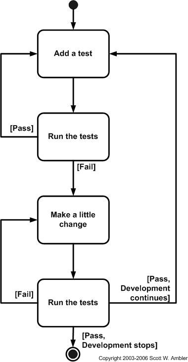

단위 테스트란
=====

 - 단위 테스트 (`Unit Test`) 는 하나의 모듈을 기준으로 독립적으로 진행되는 가장 작은 단위의 테스트
 - 통합 테스트 (`Integration Test`) 는 모듈을 통합하는 과정에서 모듈 간의 호환성을 확인하기 위해 수행되는 테스트

왜 필요한지
=====

 - TDD (Test-Driven Development, 테스트 주도 개발)
 - 테스트 코드를 수시로 빠르게 돌리면서 문제를 파악

좋은 테스트 코드는 FIRST 라는 5가지 규칙을 따라야 한다. (from 클린 코드 정의)
=====

 - `Fast`: 테스트는 빠르게 동작하여 자주 돌릴 수 있어야 한다.
 - `Independent`: 각각의 테스트는 독립적이며 서로 의존해서는 안된다.
 - `Repeatable`: 어느 환경에서도 반복 가능해야 한다.
 - `Self-Validating`: 테스트는 성공 또는 실패로 bool 값으로 결과를 내어 자체적으로 검증되어야 한다.
 - `Timely`: 테스트는 적시에 즉, 테스트하려는 실제 코드를 구현하기 직전에 구현해야 한다.

라이브러리 (Java)
=====

 - `JUnit5`: Java 단위 테스트를 위한 테스팅 프레임워크
 - `AssertJ`: Java 테스트를 돕기 위해 다양한 문법을 지원하는 라이브러리
 - `Mockito`: Java Mocking 프레임워크 (Mockito를 활용함으로써 가짜 객체에 원하는 결과를 Stub 하여 단위 테스트를 진행할 수 있음)

given/when/then 패턴
=====

 - 1개의 단위 테스트를 3가지 단계로 나누어 처리하는 패턴으로, 각각의 단계는 다음을 의미한다.

   1. `given(준비)`: 어떠한 데이터가 준비되었을 때
   1. `when(실행)`: 어떠한 함수를 실행하면
   1. `then(검증)`: 어떠한 결과가 나와야 한다.

Mockito 사용법 (Java)
=====

1. Mock 객체 의존성 주입
   - `@Mock`: Mock 객체를 만들어 반환해주는 어노테이션
   - `@Spy`: Stub하지 않은 메소드들은 원본 메소드 그대로 사용하는 어노테이션
   - `@InjectMocks`: @Mock 또는 @Spy로 생성된 가짜 객체를 자동으로 주입시켜주는 어노테이션
 
1. Stub 메소드 사용법
   - `doReturn()`: Mock 객체가 특정한 값을 반환해야 하는 경우
   - `doNothing()`: Mock 객체가 아무 것도 반환하지 않는 경우 (void)
   - `doThrow()`: Mock 객체가 예외를 발생시키는 경우
 
1. Mockito 와 JUnit5 의 결합
   - `@ExtendWith(MockitoExtension.class)`

실무 테스트 세분화 (Spring)
=====

 - `Controller Layer` 에 대한 단위테스트
 - `Service Layer` 에 대한 단위테스트

TDD 정의 (테스트 주도 개발 패턴)
=====

 - TDD = TFD + refactoring
 - The steps of test-first design (TFD)

 

자동화된 테스트 이유
=====

 - 스트레스를 많이 받으면 테스트는 점점 더 뜸하게 한다
 - 테스트를 뜸하게 하면 에러는 점점 많아질 것이다
 - 에러가 많아지면 더 많은 스트레스를 받게 된다.
