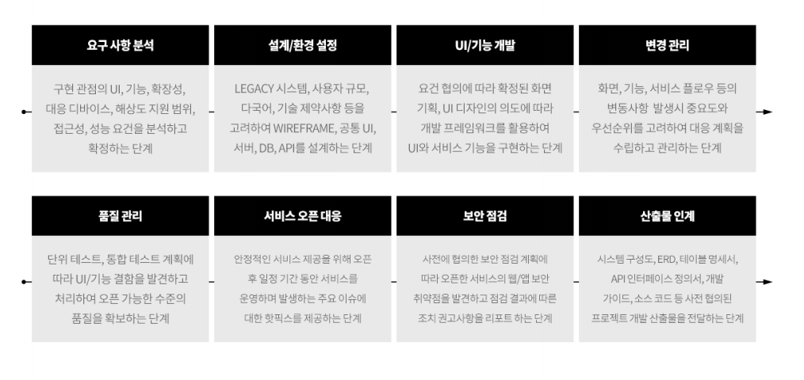

<개발 계획서>
=====

# # 추진 배경
## 개요
## 배경

 

# # 추진 방안
## 범위
## 서비스 구성도
## 구축 방안
## 시스템 구성도
## 소프트웨어 구성도
## 시나리오 분석
## 상세 개발 방안

 

# # 추진 계획
## 일정
## 투입 인력

 

<프로젝트 킥오프>
=====

# # 추진 개요
## 계획
## 체계
## 범위

 

# # 추진 방향
## 1..3

 

# # 차별화 설계 포인트
## 1..5

 

# # 주요 구축 방안
## 1..5
## 프로젝트 조직 및 인력
## 추진 일정

 

# # 기대 효과
## 1..3

 

# # Appendix
## 1..3

 

<제안서>
=====

# # 업체 현황
## 일반 현황
## 재정 현황
## 유관 사업 수행 실정

 

# # 비지니스 협력 관련
## 플랫폼 유지 관리 계획
## 일정 계획
## 수행 조직 계획

 

# # 기술적 사업 추진 역량
## 제품 개발비 산정 내역
## 제품 개발 방법론
## 적용 기술셋 확보 수준
## 제품 개발 및 유지보수 인력 구성

 

# # 부가 사항
## 제안사 강점
## 신규 BM 추가 제안

 

# # 상세 기술요구사항 답변
## 기능요구사항 명세

 

<솔루션 소개>
=====

# # 시장 동향
## 1..3

 

# # 솔루션 소개
## 개요
## 시스템 구성
## 제공 기능
## 기본 서비스 시나리오
## 기대 효과

 

# # 활용 사례
## 1..3

 

<프로젝트 수행>
=====

<프로젝트 운영>
=====

# # 사업 개요

# # 상세 내역

# # 소요 예산
## OPEX (Operating Expenditure): 운영 지출
## CAPEX (Capital Expenditure): 자본적 지출
