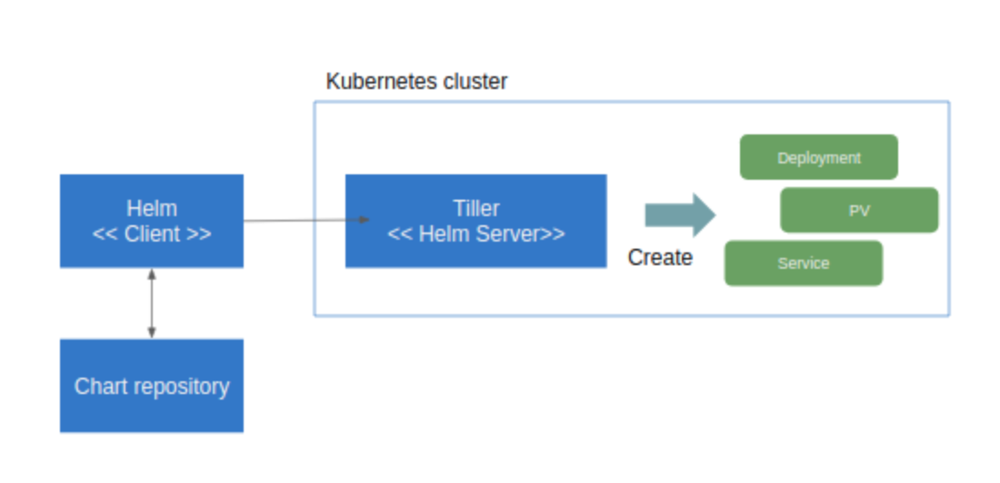
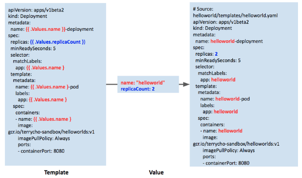
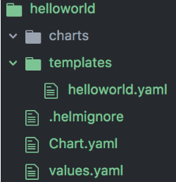

Helm
=====

- 헬름은 **패키지 관리 도구**고, 차트가 리소스를 하나로 묶은 패키지에 해당한다. 
- 헬름으로 차트를 관리하는 목적은 자칫 번잡해지기 쉬운 매니페스트 파일을 관리하기 쉽게 하기 위한 것이다.
- 실무에서는 로컬 및 운영 클러스터를 막론하고 여러 환경에 배포해야 하는 애플리케이션은 모두 **차트로 패키징**해 **kubectl 대신 helm으로 배포 및 업데이트**를 수행한다. 그 대신 이미 배포된 리소스에 대해 kubectl로 수정한다.


기본 개념
=====



- 헬름은 클라이언트(**cli**)와 서버(쿠버네티스 클러스터에 설치되는 **틸러**)로 구성된다. 
- 클라이언트는 서버를 대상으로 명령을 지시하는 역할을 한다. 서버는 클라이언트에서 전달받은 명령에 따라 쿠버네티스 클러스터에 패키지 설치, 업데이트, 삭제 등의 작업을 수행한다.
- 쿠버네티스는 서비스나 디플로이먼트, 인그레스 같은 리소스를 생성하고 매니페스트 파일을 적용하는 방식으로 애플리케이션을 배포한다. 이 **매니페스트 파일을 생성하는 템플릿**을 여러 개 패키징한 것이 차트다. 차트는 헬름 리포지토리에 tgz 파일로 저장되며, 틸러가 매니페스트를 생성하는데 사용한다.


차트 구성
=====

- 템플릿과 밸류



- 디렉토리 구조




차트 설치
=====

- helm install {릴리스 이름} {설치하려는 차트 이름}

```
$ helm install my-mariadb stable/mariadb
```

참고 사이트
=====

[**[HELM Docs]**](https://helm.sh/ko/docs/howto/charts_tips_and_tricks/)

[**[MariaDB deployment on a Kubernetes cluster using the Helm package manager]**](https://git.app.uib.no/caleno/helm-charts/-/tree/2b3d13bf2decab70228f2e02a1e05e33697376cc/stable/mariadb)

[**ㅇ /stable/mariadb/Chart.yaml**](https://git.app.uib.no/caleno/helm-charts/-/blob/2b3d13bf2decab70228f2e02a1e05e33697376cc/stable/mariadb/Chart.yaml)

[**ㅇ /stable/mariadb/templates/deployment.yaml**](https://git.app.uib.no/caleno/helm-charts/-/blob/2b3d13bf2decab70228f2e02a1e05e33697376cc/stable/mariadb/templates/deployment.yaml)

[**ㅇ /stable/mariadb/values.yaml**](https://git.app.uib.no/caleno/helm-charts/-/blob/2b3d13bf2decab70228f2e02a1e05e33697376cc/stable/mariadb/values.yaml)

[**[How to deploy application on kubernetes with helm]**](https://wkrzywiec.medium.com/how-to-deploy-application-on-kubernetes-with-helm-39f545ad33b8)

[**ㅇ /helm/app/Chart.yaml**](https://github.com/wkrzywiec/k8s-helm-helmfile/blob/master/helm/app/Chart.yaml)

[**ㅇ /helm/app/templates/deployment.yaml**](https://github.com/wkrzywiec/k8s-helm-helmfile/blob/master/helm/app/templates/deployment.yaml)

[**ㅇ /helm/app/values.yaml**](https://github.com/wkrzywiec/k8s-helm-helmfile/blob/master/helm/app/values.yaml)
